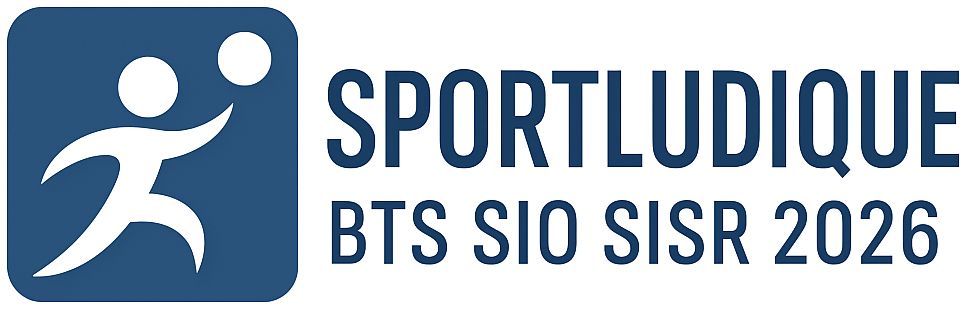

# 📚 Documentation SportLudique – BTS SIO SISR Lycée Fulbert (Promo 2026)

Bienvenue sur le dépôt officiel de la **documentation du projet SportLudique**, réalisée dans le cadre de la formation **BTS Services Informatiques aux Organisations (option SISR)** au **Lycée Fulbert de Chartres**.

---

## 🏆 Objectif du projet

Le projet **SportLudique** a pour ambition de :

- Centraliser toutes les ressources pédagogiques et techniques liées au projet.  
- Fournir une documentation claire, moderne et maintenable.  
- Accompagner les étudiants dans la compréhension des technologies systèmes, réseaux et sécurité.  
- Mettre en avant le travail de la promotion **BTS SIO SISR 2026**.  

---

## 📖 À propos de cette documentation

Cette documentation est construite avec [**MkDocs Material**](https://squidfunk.github.io/mkdocs-material/), un générateur de documentation statique pensé pour être **élégant, ergonomique et efficace**.

### ✨ Caractéristiques
- Navigation intuitive avec moteur de recherche intégré.  
- Mise en page responsive et adaptée à tous les écrans.  
- Thème professionnel avec possibilités d’extensions (code highlighting, diagrammes, etc.).  
- Documentation évolutive mise à jour régulièrement par les étudiants.  

---

## ⚙️ Déploiement continu (CI/CD)

Grâce à **GitHub Actions**, la documentation est automatiquement :  
- Construite à chaque modification du dépôt.  
- Déployée en ligne via **GitHub Pages**.  

📍 Vous pouvez consulter la documentation en ligne à l’adresse suivante :  
👉 [https://lmeryfulbert.github.io/SportLudique2025-2026](https://lmeryfulbert.github.io/SportLudique2025-2026)

---

## 👨‍🎓 Équipe Pédagogique

- Encadrants pédagogiques : **Ludovic Méry** & **Kévin Huet** – Lycée Fulbert de Chartres  

---

## 📌 Liens utiles

- [Site officiel du BTS SIO](https://www.reseau-certa.org/bts-sio)  
- [Documentation MkDocs](https://www.mkdocs.org/)  
- [Thème MkDocs Material](https://squidfunk.github.io/mkdocs-material/)  

---

## 📜 Licence

Ce projet est placé sous licence **Creative Commons Attribution (CC BY)**.  
Vous êtes libre de :  
- Partager, copier et redistribuer le contenu sous tout format.  
- Adapter, transformer et construire à partir de ce contenu.  

⚠️ **Obligation** : citer les sources et donner le crédit approprié.  

👉 [En savoir plus sur la licence CC BY](https://creativecommons.org/licenses/by/4.0/)

---

✍️ *Dernière mise à jour : Septembre 2025