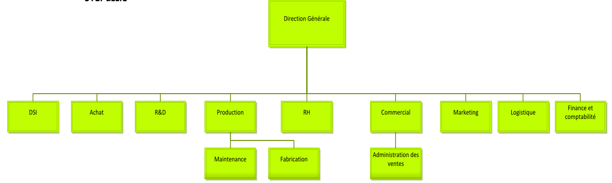
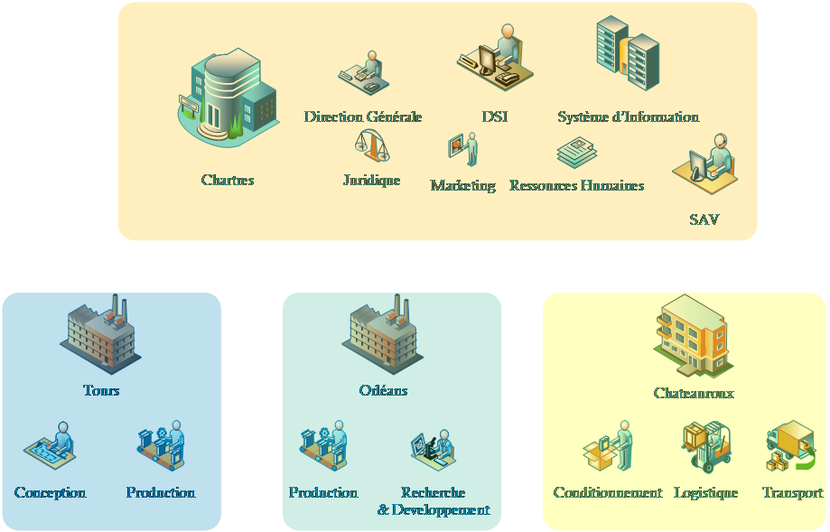

# Présentation
## BTS SIO option SISR
## Année scolaire 2025-2026
**Auteur :** Ludovic MERY
**Co-Enseignant** : Kevin Huet

## Présentation générale de l’entreprise

##  Activité

SportLudique SARL est une société implanté en région centre spécialisée
dans la conception et la fabrication d’articles de sports et de loisirs
composée de 452 personnes réparties autour de trois sites géographiques
: Chartres, Tours, Orléans.

Elle dispose d’un quatrième site sur Bourges suite à la mise en
place d’une filiale spécialisée dans la logistique.

Le siège de SportLudique se situe dans l’agglomération chartraine.

Elle enregistre de bons résultats grâce à une gamme de produits complète
(pour tous les âges) et connaît depuis peu un essor considérable
proposant des installations clé en main aux collectivités

## Données économiques et juridiques

| Dénomination sociale       | SportLudique      |
|---------------------------|------------------|
| Début d'activité :         | 16/10/1995       |
| Siret :                   | 347839493 00021  |
| Statut juridique          | SARL             |
| Capital Social            | 485 000 €        |
| Chiffre d’affaire 2014    | 8 562 000 €      |
| Benefice net 2014         | 1 735 200 €      |
| Nombre d’employés         | 452              |

## Organigramme

La Direction des Services Informatiques est sous la direction de
Monsieur Claude Postic

Celui-ci a sous ses ordres 4 techniciens.

Le service RH est dirigé par Ms Helen Paisley-Le Bihan.

##  Situation et répartition géographique

La société est articulée autour de quatre sites géographiques :

-   le site de Chartres : il regroupe la direction, le marketing, les
    > finances, les ressources humaines et la direction des services
    > informatiques (DSI) ;

-   le site d’Orléans : il regroupe l’usine de production des
    équipements extérieurs bois.

-   le site de Tours : il regroupe le laboratoire de test et la
    > production des équipements plastique

-   le site de Bourges : situé idéalement au centre de la France,
    > les stocks et la logistique sont la spécialité de ce site.

