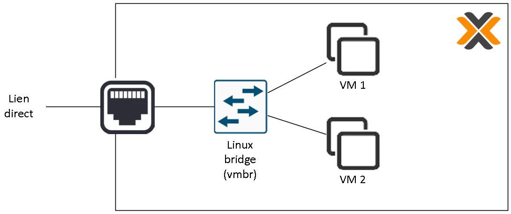
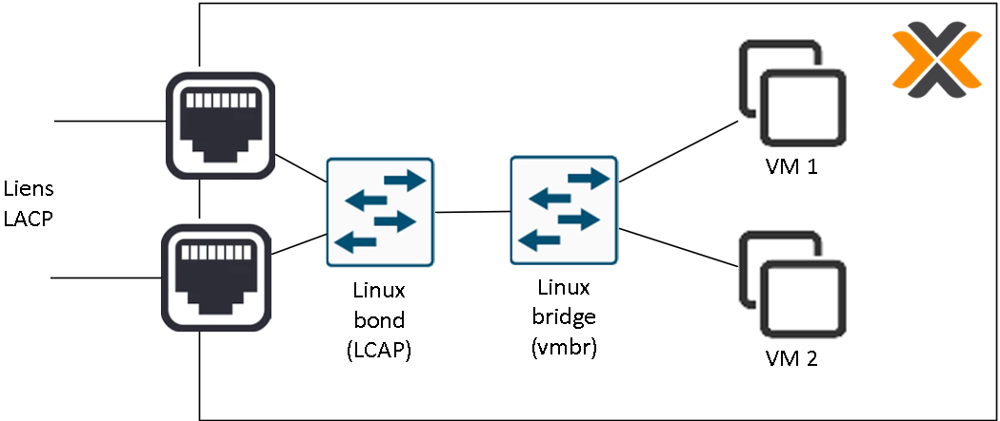

# Gestion des réseaux sous Promox

## Réseaux et virtualisation

Dans un hyperviseur, tous les éléments réseau se trouvant "derrière" la carte réseau sont virtuels. Selon les hyperviseurs, il est possible de virtualiser ou non certains concept réseaux. Proxmox étant basé sur GNU/Linux, il est possible de virtualiser un vaste panel de ces concepts de manière flexible.

Il existe 3 principaux types d'éléments réseau très utiles dans Proxmox :

- Linux **Brige** : un switch virtuel pouvant acheminer des VLAN (en mode trunk).
- Linux **VLAN** : une interface virtuelle mettant à disposition un VLAN en mode access pour le serveur Proxmox.
- Linux **Bond** : une aggrégation d'interfaces physiques gérant plusieurs protocoles (notamment LACP).

Pour gérer les différents éléments réseaux de Proxmox, il suffit de cliquer sur le noeud en question dans l'interface web, puis d'aller dans l'item "Système" => "Réseau".

Il existe également la possibilité de déployer des réseaux distribués virtuels (**SDN** ou Software Defined Networking) connecter des VMs en access à différents VLANs.
Pour cela, il est nécessaire de créer une **zone de type VLAN**, et d'y attacher des **VNets** (réseaux virtuels) correspondant chacun à un VLAN. Il ne restera plus qu'à connecter les interfaces des VM directements aux bons VNets.

La gestion des réseaux virtuels distribués est réalisée en cliquant sur le centre de données puis en allant dans l'item "SDN" => "Zones" pour les zones, ou "SDN" => VNets pour les réseaux virtuels.

## Combinaisons d'éléments

Dans proxmox, il est possible de combiner ces différents éléments en les cascadant pour parvenir la solution recherchée. Vous trouverez quelques exemples ci-dessous.

Exemple de connexion directe de VMs au réseau de l'hyperviseur :

Exemple de connexion de VMs un VLAN avec interconnexion de l'hyperviseur en mode trunk :

Exemple de connexion directe de VMs avec interconnexion de l'hyperviseur en LACP 

Lors de la combinaison des différents éléments, n'oubliez pas de renseigner les ports esclaves pour les bonds, les ports du pont pour les bridges, et les périphériques support pour les vlans!