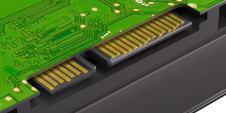
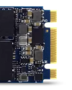
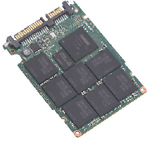
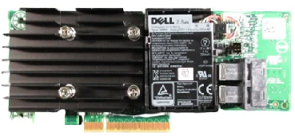

# Stockage matériel

## Introduction
Le choix du stockage sur un serveur est très important. Les supports de stockage doivent être à la fois fiable pour **fonctionner 24/24 7J/7**, et suffisamment **performant** pour répondre rapidement à une demande.
Le coût sera également un facteur déterminant dans le dimensionnement et le choix de la technologie utilisée.

### Les critères techniques importants à prendre en compte
- Le **débit** en Mo/s
- La **latence**, représentant le temps de réponse exprimé en millisecondes ou microsecondes
- Le nombre d'opération par secondes exprimées en **IOPS** (Input/Output operations per second)

## Les différentes normes de communication

### SATA
D'abord conçu pour les PC grand publique, SATA a été intégré dans les serveurs grâce à son **faible coût**. Sont débit maximum est 6 Gb/s théorique (environ 600Mo/s en pratique).

 

### SAS
Le SAS est dédié aux serveur, il a une vitesse maximum théorique de 12 Gb/s (1.2Go /s en pratique).
La **fiabilité** des support utilisant le SAS est très élevée, expliquant le **coût** du SAS généralement **plus élevé** que le SATA.

### NVMe (PCIe)
La norme NVMe a été conçue pour accéder au stockage directement à travers le bus PCI Express. Cela permet un **temps d'accès beaucoup plus faible** et des **débits beaucoup plus élevés** : le débit maximum peut monter jusqu'à 14 Go/s sur 4 lignes PCIe 5.0 . En contrepartie, ces disque sont **les plus onéreux**.
Seuls des support de stockages types SSD sont capable d'exploiter cette connectique.

## Les différents supports

### HDD
Les HDD (Hard Disk Drive) sont des supports magnétiques et mécaniques utilisant des plateaux métalliques pour stocker les données. A cause du mouvement des pièces mécaniques le **temps d'accès** de ces supports est **mauvais**. Le **débit** d'un HDD est également relativement **faible** par rapport à un SSD.
La durée de vie d'un HDD dépend essentiellement de la qualité de ses pièces mécaniques, elle tout même considérée comme longue. Ces disques sont aujourd'hui **très bon marché**.

### SSD
Les SSD sont des supports utilisant des puces mémoires pour stocker les informations. Cela permet un **temps d'accès très faible** comparé à un disque mécanique. Le nombre d'**IOPS** peut donc être **très élevé**.
Bien que la durée de vie d'un SSD est théoriquement limitée dans le temps, on peut considérer aujourd'hui qu'un support sera considéré comme obsolète avant de l'avoir usé complètement.
Leur densité continuant aujourd'hui d'augmenter grâce aux avancés de l'industrie des semi-conducteurs, leur capacité de stockage maximum devrait très vite rejoindre voire dépasser celle des HDD.

## Spécificité des controlleurs de stockage des serveurs
Les serveurs d'aujourd'hui sont presque tous équipés de controlleurs RAID matériel. Ces controleurs gèrent directement les disques de stockage, qu'ils soient mécaniques ou SSD. Ils permettent de réaliser des "grappes" RAID aussi appelés disques virtuels. Ces disques virtuels sont présentés directement au système installé sur le serveur comme un disque. Le système d'exploitation n'a donc pas à se préocuper de la gestion matérielle des disques. 

 

Les disques connectés à un controlleur de stockage de serveur sont échangeables à chaud ("hot swappable"), permettant de les remplacer pendant que le serveur est en fonctionnement. Ces disques sont accessibles directement sur la façade du serveur pour être retirés rapidement en cas de besoin :

D'autre part, un cache de bonne capacité (parfois plusieurs Go) ainsi qu'une batterie sont généralement présents sur ces controlleurs afin d'assurer la fin correcte des opérations d'écriture sur les disques en cas de rupture d'alimentation, limitant ainsi grandement la corruption des données.

## Pour résumer
- Le **SATA** est la solution la **moins cher**, mais **peu performant**.
- Le **SAS** permet un **bonne fiabilité** et de **bonnes performances**.
- Le **NVMe** est le **plus onéreux**, mais possède d'**excellentes perfomances**

