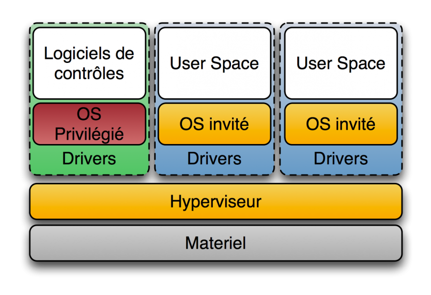
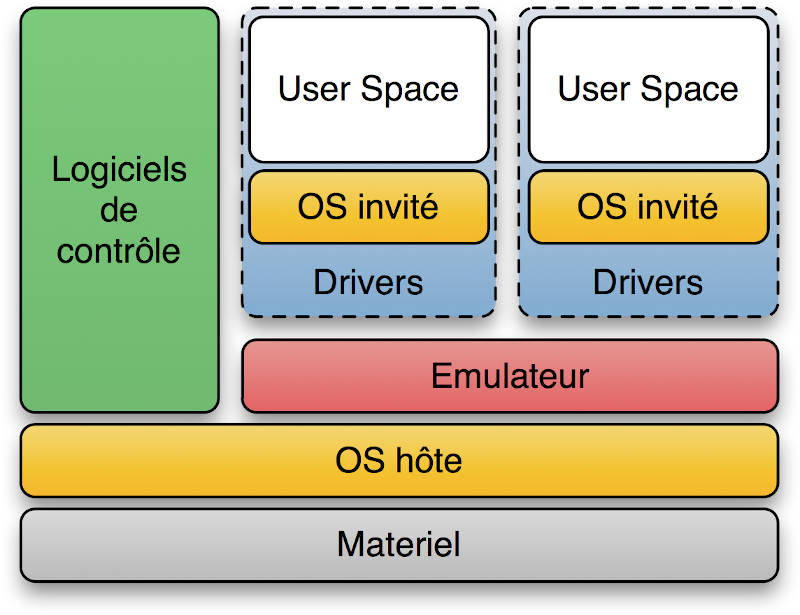

# 03-Virtualisation

## Type d'hyperviseurs

Les hyperviseurs sont des logiciels qui permettent de créer et de gérer des machines virtuelles (VMs) sur un matériel physique. Il existe deux types principaux d'hyperviseurs : le type 1 (bare-metal) et le type 2 (hosted). Voici un aperçu des différences entre ces deux types d'hyperviseurs :

### Hyperviseur de Type 1 (Bare-Metal) :

1. **Exécution directe** : Les hyperviseurs de type 1 s'exécutent directement sur le matériel physique du serveur, sans nécessiter un système d'exploitation hôte intermédiaire. Cela signifie qu'ils ont un accès plus direct aux ressources matérielles.

2. **Performances** : En raison de leur accès direct au matériel, les hyperviseurs de type 1 ont tendance à offrir de meilleures performances que les hyperviseurs de type 2. Ils sont généralement utilisés dans des environnements où les performances sont essentielles, tels que les datacenters d'entreprise.

3. **Exemples** : VMware vSphere/ESXi, Microsoft Hyper-V (dans sa version pour serveurs), et KVM sont des exemples d'hyperviseurs de type 1.

4. **Utilisation** : Les hyperviseurs de type 1 sont généralement utilisés dans des environnements de production, où la virtualisation est une composante essentielle de l'infrastructure.

### Hyperviseur de Type 2 (Hosted) :

1. **Exécution au-dessus d'un système d'exploitation** : Les hyperviseurs de type 2 s'exécutent au-dessus d'un système d'exploitation hôte existant, ce qui signifie qu'il y a une couche logicielle supplémentaire entre l'hyperviseur et le matériel physique.

2. **Facilité d'utilisation** : Les hyperviseurs de type 2 sont généralement plus faciles à installer et à utiliser, car ils s'appuient sur un système d'exploitation existant. Ils sont souvent utilisés pour le développement, le test et l'apprentissage.

3. **Performances moindres** : En raison de la couche logicielle supplémentaire, les hyperviseurs de type 2 ont tendance à avoir des performances légèrement inférieures par rapport aux hyperviseurs de type 1. Cependant, pour de nombreuses charges de travail, cette différence de performance peut ne pas être significative.

4. **Exemples** : VirtualBox, VMware Workstation, Parallels Desktop (pour macOS) sont des exemples d'hyperviseurs de type 2.

5. **Utilisation** : Les hyperviseurs de type 2 sont souvent utilisés dans des environnements de développement, de test, d'émulation, et par des utilisateurs individuels qui souhaitent exécuter des systèmes d'exploitation invités sur leur propre machine.

En résumé, la principale différence entre les hyperviseurs de type 1 et de type 2 réside dans leur relation avec le matériel. Les hyperviseurs de type 1 s'exécutent directement sur le matériel, tandis que les hyperviseurs de type 2 s'exécutent au-dessus d'un système d'exploitation hôte. Le choix entre les deux dépend des besoins spécifiques de virtualisation et des performances de votre environnement.

## Définition de l’hyperconvergence

L’hyperconvergence est une approche d’architecture informatique qui consiste à intégrer dans une seule plateforme logicielle les trois piliers traditionnels d’un datacenter :

- le calcul (CPU et mémoire pour exécuter les machines virtuelles),
- le stockage (disques locaux mutualisés et gérés comme une seule ressource partagée),
- et le réseau (communications internes entre les nœuds du cluster).

Contrairement à une infrastructure traditionnelle où ces éléments sont gérés séparément (serveurs, SAN/NAS, commutateurs spécialisés fiber channel), l’hyperconvergence repose sur un hyperviseur et du stockage défini par logiciel (SDS) pour combiner toutes ces ressources au sein d’un même cluster.

??? info "Notion"

    Chez Proxmox la solution repose sur le système **CEPH**

!!! important "Important"

    **Ceph** est une solution de stockage distribué open source conçue pour offrir une grande scalabilité, une tolérance aux pannes et des performances élevées. Il repose sur l’agrégation de disques présents dans plusieurs serveurs (appelés nœuds) pour créer un espace de stockage unique, vu comme un seul système.
    **Utilisation :** souvent employé dans des environnements de cloud (OpenStack, Proxmox, Kubernetes) pour fournir un stockage résilient et distribué aux machines virtuelles et conteneurs.

**Avantages :**

- Simplification de la gestion (administration unifiée via une console unique).
- Scalabilité linéaire : on ajoute simplement des nœuds pour augmenter la capacité.
- Réduction des coûts et de la complexité (moins de matériel spécialisé comme les SAN).
- Haute disponibilité et résilience intégrées.

## Solutions techniques

Les hyperviseurs sont des logiciels qui permettent de créer et de gérer des machines virtuelles (VMs) sur un serveur physique. Ils sont essentiels pour la virtualisation, qui permet d'exécuter plusieurs systèmes d'exploitation et applications sur un seul matériel physique. Voici un petit cours sur les hyperviseurs, en mettant en avant VMware, Hyper-V, VirtualBox et Nutanix, tout en discutant des spécificités de l'hyperconvergence.

### VirtualBox :

 **Type d'hyperviseur** : VirtualBox que vous avez utilisé l'an dernier est un hyperviseur de **type 2**, ce qui signifie qu'il s'exécute sur un système d'exploitation hôte existant (Windows, macOS, Linux).
   
 **Caractéristiques** : VirtualBox est adapté pour les environnements de développement, de test et d'apprentissage. Il est open source et offre une interface utilisateur conviviale.

 **Concurents** : 

- **VMware Workstation** (et VMware Fusion pour macOS) : hyperviseurs de type 2 commerciaux offrant plus de fonctionnalités avancées et une meilleure intégration professionnelle.

- **Hyper-V** (intégré aux éditions professionnelles et serveurs de Windows) : même si c’est un hyperviseur de type 1, il peut être vu comme un concurrent car il est directement disponible sur Windows et souvent utilisé pour la virtualisation locale.

### VMware :
   
 **Type d'hyperviseur** : VMware propose deux types d'hyperviseurs - VMware vSphere/ESXi pour les environnements d'entreprise et VMware Workstation/Fusion pour les environnements de développement et de test.
   
 **Caractéristiques** : VMware est l'un des leaders du marché de la virtualisation. Il offre des fonctionnalités avancées telles que la migration à chaud, la gestion automatisée des ressources, la haute disponibilité, la réplication et la gestion centralisée avec vCenter Server.

 **Hyperconvergence** : VMware propose une solution hyperconvergée appelée VMware vSAN. Il combine stockage et calcul sur un même cluster de serveurs pour simplifier la gestion et améliorer les performances.

### Hyper-V :

 **Type d'hyperviseur** : Hyper-V est l'hyperviseur de Microsoft, intégré à Windows Server. Il existe également une version gratuite appelée Hyper-V Server.
   
 **Caractéristiques** : Hyper-V offre une virtualisation robuste avec des fonctionnalités telles que la migration en direct, la mise en cluster, la gestion à distance via Hyper-V Manager ou PowerShell, et la prise en charge des machines virtuelles Linux et Windows.

 **Hyperconvergence** : Microsoft propose Azure Stack HCI, une solution hyperconvergée basée sur Hyper-V. Elle offre une plateforme de calcul et de stockage hautement intégrée.

### Nutanix :

**Type d'hyperviseur** : Nutanix est une plateforme hyperconvergée qui intègre son propre hyperviseur, appelé Acropolis Hypervisor (AHV). Cependant, il prend également en charge d'autres hyperviseurs comme VMware ESXi et Hyper-V.
   
**Caractéristiques** : Nutanix offre une solution hyperconvergée tout-en-un, combinant stockage, calcul et gestion dans un cluster évolutif. Il simplifie la gestion, offre une haute disponibilité et une scalabilité linéaire.

**Hyperconvergence** : Nutanix est une solution hyperconvergée par excellence, car elle combine tous les éléments nécessaires pour exécuter des charges de travail virtualisées de manière efficace.

### Proxmox :

**Type d'hyperviseur** : Proxmox VE est un hyperviseur de type 1 (bare-metal) basé sur **KVM (Kernel-based Virtual Machine)**pour la virtualisation matérielle et LXC (Linux Containers) pour la virtualisation basée sur conteneurs.

**Caractéristiques :**
- Gestion centralisée des machines virtuelles et des conteneurs via une interface web conviviale.
- Prise en charge de la haute disponibilité avec la possibilité de migration en direct des machines virtuelles.
- Intégration du stockage défini par logiciel (Software-Defined Storage) pour la gestion des données.
- Prise en charge des conteneurs Linux via LXC pour une efficacité accrue des ressources.
- Intégration de la sauvegarde et de la restauration des machines virtuelles et des conteneurs.

!!! important "Important"

    KVM (Kernel-based Virtual Machine) est un hyperviseur de type 1 intégré au noyau Linux, qui transforme un système Linux en plateforme de virtualisation complète. Il utilise les extensions matérielles (Intel VT-x, AMD-V) pour exécuter des machines virtuelles avec des performances proches du natif. Utilisation : KVM est largement employé dans les datacenters et solutions de cloud open source, comme Proxmox VE, OpenStack ou oVirt, pour gérer des machines virtuelles Linux et Windows de manière fiable et performante.

### Xen :

 **Type d'hyperviseur** : Xen est un hyperviseur de type 1 (bare-metal) open source, initialement développé à l’Université de Cambridge. Il a ensuite été commercialisé par XenSource, racheté en 2007 par **Citrix**, qui l’a intégré dans son produit XenServer (aujourd’hui appelé Citrix Hypervisor). Depuis 2013, le projet open source est géré par la Linux Foundation sous le nom de **Xen Project**, avec Citrix comme contributeur majeur aux côtés d’autres acteurs.

 Il ne sera pas mis en oeuvre mais sachez qu'il existe. On priviligiera les solutions basées sur KVM.

**Caractéristiques :**

Xen utilise une architecture particulière avec un domaine privilégié appelé Dom0, qui gère les interactions avec le matériel et les pilotes, et des domaines invités appelés DomU pour exécuter les machines virtuelles.

Il prend en charge deux modes de virtualisation : la paravirtualisation (PV), qui nécessite un OS modifié pour fonctionner efficacement, et la virtualisation complète (HVM), qui repose sur les extensions matérielles de virtualisation (Intel VT-x, AMD-V).

Xen est reconnu pour sa sécurité renforcée et sa modularité, ce qui en fait un choix fréquent pour des environnements sensibles.

**Utilisation** :
Xen est largement utilisé dans les infrastructures de cloud computing, notamment par Amazon Web Services (AWS) pour son service EC2, ainsi que dans certains systèmes embarqués et environnements nécessitant une isolation forte.

