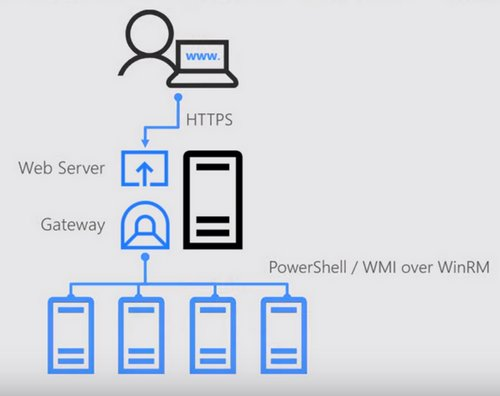

# Configuration de base - Serveurs

## Serveurs Linux

### Configuration IP

- Configurer la ou les IP statique dans`/etc/network/interfaces`
- Vérifier la passerelle et les routes.

### Configuration du Resolver DNS
- Configurer le resolver DNS dans `/etc/resolv.conf`
- Bien vérifier si le resolver n'est pas géré par `Network Manager`
- Indiquer un Resolver principal et un de secours.
- Verification avec `nslookup` ou `dig` (paquet `dns-utils`)

### Configuration de l'horloge (Synchronisation avec NTP)

- Utiliser chrony (recommandé depuis Debian 10 / Ubuntu 18) 

````bash
apt install chrony
````

Dans `etc/chrony/chrony.conf` :

- Ajouter plusieurs serveurs NTP (internes si dispo)
- Autoriser la dérive raisonnable

- Verification de la synchronisation des horloges
````bash
chronyc tracking
chronyc sources
````

### Configuration du nom de la machine (hostname)

- Cohérent, court, ayant du sens par rapport au service rendu, sans caractère spécial.
- Définir dans `/etc/hostname` et `/etc/hosts`.

````bash
echo "srv-http01" > /etc/hostname
hostnamectl set-hostname srv-http01
````

### Configuration SSH (sécurisée)

Fichier : `/etc/ssh/sshd_config`

- Désactiver l’accès root
- Privilegier l'authentification par clé SSH si possible
- Limiter les utilisateurs autorisés (les admins système)

### Configuration de la journalisation (Logs)

- Activer et configurer rsyslog (défaut).
- Conserver les logs suffisants :
  -  /var/log/auth.log
  -  /var/log/syslog
  -  /var/log/kern.log
  -  Logs applicatifs dans `/var/log/<service>`

- Rotation via `logrotate`

Pour plus de logs

- Installer `auditd`

### Configuration d'un agent SIEM (Serveur de Logs)

Un `SIEM (Security Information and Event Management)` est une plateforme centralisée qui collecte, corrèle et analyse les journaux (logs) provenant de serveurs, postes, firewalls, applications ou services cloud.
Son objectif principal est de détecter rapidement les incidents de sécurité.

Il permet:
  - Centraliser tous les logs au même endroit
  - Détecter des comportements suspects (ex : brute force, exfiltration)
  - Générer des alertes en temps réel
  - Conserver les journaux pour l’analyse forensique
  - Faciliter les obligations légales (RGPD, conformité)

Exemple:
  - Wazuh
  - Splunk
  - ELK / OpenSearch SIEM
  - Microsoft Sentinel
  - Graylog avec extensions de sécurité

Sans SIEM, chaque machine a ses logs isolés, ce qui rend quasi impossible la détection d’une attaque coordonnée.
Un SIEM permet de voir l’activité globale du système d’information.

- Installer l'agent SIEM pour communiquer avec le Serveur

### Configuration d'une politique de sauvegarde

- Conserver au moins l'ancienne versions d'une config (revenir à l'état anterieur fonctionnel).
- Dans l'ideal versionner avec git (`etckeeper`) `/etc/` et pousser sur un serveur de confiance (un gitlab interne par exemple)
- Faire des backup
    - VEAM pour des VM
    - rsync + cron pour seulement des fichiers.

Sécuriser l’accès à la sauvegarde :

- Authentification
- Réseau isolé (Management deconnecté d'internet)
- Horodatage et immuabilité si possible

Règle classique “7 daily backups” utilisée par de nombreux systèmes

Beaucoup de solutions appliquent par défaut :

- 7 backups journaliers  (1 / jour)
- 4 backups hebdomadaires (1 / semaine)
- 12 backups mensuels (1 / mois)

### Configuration pour un serveur de Supervision

- Activer SNMP si nécessaire (serveur devant rester hautement disponible)
- Utiliser SNMPv3 avec mot de passe fort et chiffrement (pas de communauté public si pas d'utilisation de la version 3)
- Limiter l’accès à un serveur de supervision ou VLAN dédié (management ou monitoring)
- Configurer des traps ou alertes pour les événements critiques
- Journaliser toutes les requêtes SNMP pour audit si possible


## Serveurs Windows

La configuration d’un serveur Windows demande une attention particulière, notamment lorsqu’il est destiné à rejoindre un domaine Active Directory ou à héberger des rôles critiques.
Voici les bonnes pratiques essentielles.

### Bonnes pratiques

Il est impératif de choisir le nom définitif du serveur avant son ajout au domaine Active Directory.

!!! Danger "Attention"
    Renommer une machine déjà membre du domaine peut provoquer :<br/>
    - des erreurs Kerberos <br/>
    - des objets dupliqués dans l’AD<br/>
    - des problèmes DNS et SPN<br/>
    - un dysfonctionnement des rôles ADDS liés<br/>
    - Cela oblige souvent à retirer et réintégrer le serveur au domaine.<br/>

RDP uniquement pour les administrateurs
- Jamais exposé à Internet
- accessible seulement depuis un réseau d’administration isolé ou une machine d’administration dédiée

Les éditions Windows Server Core sont allégées :

- pas d’interface graphique
- moins de services actifs
- moins de failles potentielles
- moins de mises à jour
- moins de ressources utilisées
- Administration à distance facilitée (PowerShell, RSAT, WinRM)

N'installer le bureau que si necessaire, privilegier les version Core et management avec une machine dédié à l'administration se connectant aux différents serveurs windows (outil RSAT ).

Differents outils d'administration:

- PowerShell Remoting (WinRM)
- Console Server Manager distante
- RSAT (Remote Server Administration Tools)
- MMC distante (DNS, ADDS, DHCP, etc.)
- Windows Admin Center



Dans l'idéal on passera par un Bastion d'administration qui servira de Passerelle applicative.
Les postes des administrateurs (sous windows) peuvent disposer de l'application Windows Admin Center pour gérer les serveurs.


### Principe fondamental : 1 serveur = 1 rôle

- Serveur ADDS → uniquement contrôleur de domaine + Service DNS (Exception pour ADDC + DNS car Un contrôleur de domaine Windows doit héberger DNS pour que le domaine fonctionne correctement.)
- Serveur de fichiers → uniquement file server
- Serveur WSUS → uniquement WSUS
- Serveur RDS → uniquement Remote Desktop Services (Attention aux licences !!!!!!! ) 

### Sécuriser les rôles sensibles : PKI / Autorités de Certification

Une PKI interne (Autorité de Certification Windows) doit être protégée comme un rôle hautement critique.
La moindre compromission peut mettre en péril toute la confiance interne.
Journalisation de tous les evennement obligatoire.

Si possible, utiliser une CA racine (root) hors ligne : clé privée totalement déconnectée du réseau. Toute la chaine de confiance reposera sur cette Autorité.

Les CA deleguées peuvent être en ligne pour délivrer les certificats aux serveurs et utilisateurs.

Limiter l’accès réseau aux seules machines d’administration autorisées.

RDP / GUI uniquement depuis le réseau d’administration dédié.

Tous les événements liés à la PKI doivent être journalisés et centralisés.

- Activer la journalisation détaillée via Event Viewer / Security / ADCS :

  -  Demandes de certificat
  -  Délivrances
  -  Révocations
  -  Modifications de templates
  -  Accès aux clés privées

- Envoyer ces logs vers un SIEM pour corrélation et alerting.
- Faire des backups et test de restauration regulierement

Conserver au moins 3 versions historiques des bases de certificats et clés privées.

Suivre la politique 3-2-1 de l'ANSSI :

  - 3 copies
  - 2 supports différents
  - 1 copie hors site