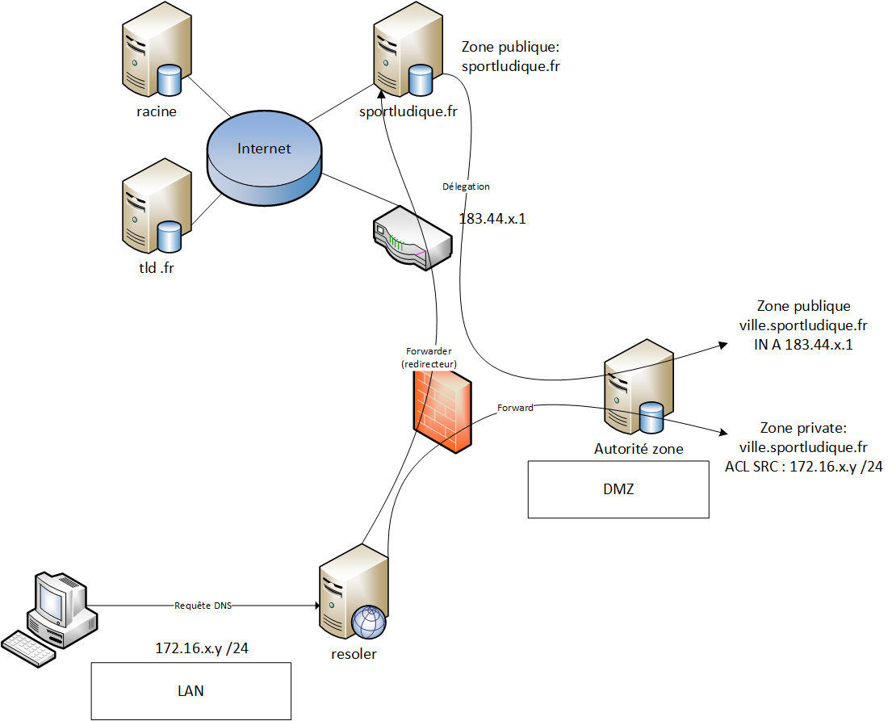

# 01 - DNS (Domain Name System) 

## Introduction aux DNS

Les DNS, ou Domain Name System, sont un système fondamental d'Internet qui permet de traduire les noms de domaine en adresses IP et vice-versa. Ils jouent un rôle essentiel dans la navigation sur le Web et la communication entre les appareils connectés à Internet.

## Résolveurs DNS

voir page dédiée

## Serveurs d'autorité

Les serveurs d'autorité sont des serveurs DNS responsables d'une zone DNS particulière. Ils ont la capacité d'autoriser des requêtes pour les noms de domaine dans leur zone respective. Les zones DNS sont généralement définies pour représenter une partie de l'arborescence des noms de domaine, et chaque zone a un serveur d'autorité qui la gère.

## Séparation des rôles

La séparation des rôles dans le système DNS est une pratique courante pour garantir la sécurité et la fiabilité. Cette séparation peut être réalisée en utilisant différents serveurs pour les rôles spécifiques, tels que les serveurs de résolution, les serveurs d'autorité et les serveurs de redirection.

!!! info "Attention"
    Il y a souvent confusion entre les rôle de Resolveur et Autorité.

## Redirecteurs DNS

Les redirecteurs DNS sont des serveurs DNS qui redirigent les requêtes DNS vers d'autres serveurs DNS, généralement les serveurs d'autorité appropriés. Ils sont utiles pour améliorer l'efficacité du système DNS en évitant des requêtes inutiles aux serveurs racine.

## Serveurs Racine

Les serveurs racine sont le niveau le plus élevé de la hiérarchie DNS. Ils stockent les informations de base pour l'ensemble du système DNS et sont responsables de renvoyer les requêtes vers les serveurs d'autorité appropriés pour les domaines de premier niveau (TLD) tels que .com, .org, .net, etc.

## Délégation des Zones

La délégation des zones est le processus par lequel une autorité parente confie la gestion d'une zone DNS à une autorité enfant. Cela permet de distribuer la responsabilité de la gestion des noms de domaine dans la hiérarchie DNS. Par exemple, le registraire d'un domaine peut déléguer la gestion de la zone DNS à l'hébergeur Web du propriétaire du domaine.

## Schema de l'infrastructure DNS pour SportLudique

