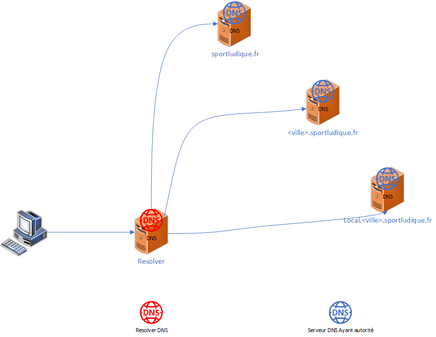
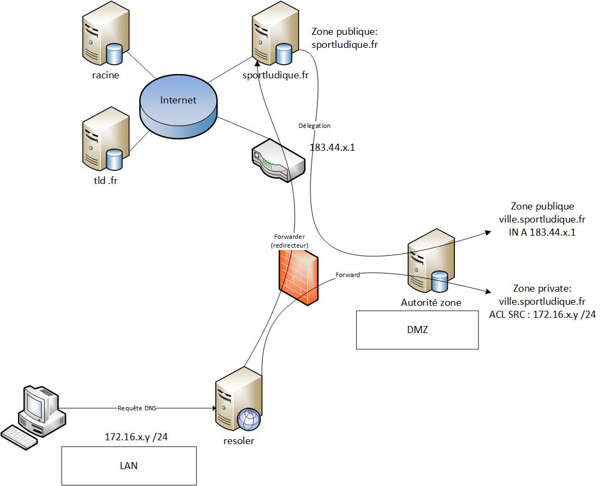
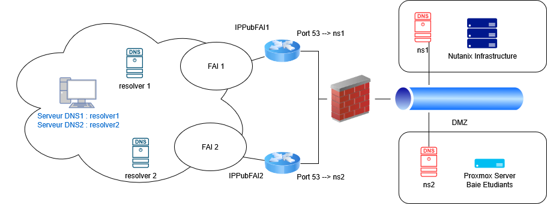

# DNS (Domain Name System) 

## Introduction aux DNS

Les DNS, ou Domain Name System, sont un système fondamental d'Internet qui permet de traduire les noms de domaine en adresses IP et vice-versa. Ils jouent un rôle essentiel dans la navigation sur le Web et la communication entre les appareils connectés à Internet.

## Résolveurs DNS

Un résolveur DNS est un logiciel ou un service responsable de la résolution des noms de domaine en adresses IP. Les résolveurs sont généralement utilisés par les appareils clients pour interroger le système DNS et obtenir les adresses IP associées aux noms de domaine.

## Serveurs d'autorité

Les serveurs d'autorité sont des serveurs DNS responsables d'une zone DNS particulière. Ils ont la capacité d'autoriser des requêtes pour les noms de domaine dans leur zone respective. Les zones DNS sont généralement définies pour représenter une partie de l'arborescence des noms de domaine, et chaque zone a un serveur d'autorité qui la gère.

## Séparation des rôles

La séparation des rôles dans le système DNS est une pratique courante pour garantir la sécurité et la fiabilité. Cette séparation peut être réalisée en utilisant différents serveurs pour les rôles spécifiques, tels que les serveurs de résolution, les serveurs d'autorité et les serveurs de redirection.

## Redirecteurs DNS

Les redirecteurs DNS sont des serveurs DNS qui redirigent les requêtes DNS vers d'autres serveurs DNS, généralement les serveurs d'autorité appropriés. Ils sont utiles pour améliorer l'efficacité du système DNS en évitant des requêtes inutiles aux serveurs racine.

## Serveurs Racine

Les serveurs racine sont le niveau le plus élevé de la hiérarchie DNS. Ils stockent les informations de base pour l'ensemble du système DNS et sont responsables de renvoyer les requêtes vers les serveurs d'autorité appropriés pour les domaines de premier niveau (TLD) tels que .com, .org, .net, etc.

## Délégation des Zones

La délégation des zones est le processus par lequel une autorité parente confie la gestion d'une zone DNS à une autorité enfant. Cela permet de distribuer la responsabilité de la gestion des noms de domaine dans la hiérarchie DNS. Par exemple, le registraire d'un domaine peut déléguer la gestion de la zone DNS à l'hébergeur Web du propriétaire du domaine.

Pour déléguer une zone à un autre serveur DNS (non BIND) à l'aide de BIND comme serveur parent, vous devrez configurer des enregistrements NS pour le sous-domaine délégué dans votre zone parente. Voici comment faire cela :

Supposons que vous utilisez BIND comme serveur DNS principal pour le domaine `exemple.com` et que vous souhaitez déléguer la gestion du sous-domaine `sousdomaine.exemple.com` à un autre serveur DNS dont l'adresse IP est `203.0.113.100`.

**Configuration BIND (zone principale pour exemple.com) :**

1. Dans le fichier de zone pour `exemple.com`, ajoutez les enregistrements NS pour le sous-domaine délégué comme ceci :

```plaintext
; Fichier de zone pour exemple.com (zone publique)
$TTL 3600

@      IN      SOA    ns1.exemple.com. admin.exemple.com. (
                  2023091301 ; Numéro de série
                  3600       ; Intervalle de rafraîchissement
                  1800       ; Intervalle de réessai
                  604800     ; Intervalle d'expiration
                  86400 )    ; Durée minimale de cache

;choisir une des 2 syntaxes avec le @ ou en recopiant le domaine (avec le point à la fin)
;@      IN      NS     ns1.exemple.com.
exemple.com.        IN      NS      ns1.exemple.com.

; Serveur DNS primaire
ns1     IN      A       203.0.113.40

; Enregistrements IPv4 des serveurs web
@      IN      A      203.0.113.10
; le @ remplace la zone DNS, tres utile pour acceder au site web sans le www, on en reparlera avec le Subject Alternative Name des certificats pour TLS
www    IN      A      203.0.113.10

; Enregistrements IPv4 du serveur de messagerie
mail   IN      A      203.0.113.30

; Délégation du sous-domaine à un autre serveur DNS
sousdomaine.exemple.com.  IN  NS  ns.sousdomaine.exemple.com.
```

**Notez que dans cet exemple, nous utilisons l'enregistrement NS `ns.serveurdns.externe.com` pour déléguer la gestion du sous-domaine `sousdomaine.exemple.com` à un serveur DNS externe. Vous devez remplacer `ns.serveurdns.externe.com` par le nom de domaine complet du serveur DNS externe qui gérera le sous-domaine.**

**Configuration sur le serveur DNS externe (ns.serveurdns.externe.com) :**

1. Configurez le serveur DNS externe pour répondre aux requêtes pour le sous-domaine `sousdomaine.exemple.com`.

2. Créez les enregistrements DNS appropriés pour le sous-domaine `sousdomaine.exemple.com` sur le serveur DNS externe, par exemple :

```plaintext
; Configuration sur le serveur DNS externe
$TTL 3600

@      IN      SOA    ns.sousdomaine.exemple.com. admin.sousdomaine.exemple.com. (
                  2023091301 ; Numéro de série
                  3600       ; Intervalle de rafraîchissement
                  1800       ; Intervalle de réessai
                  604800     ; Intervalle d'expiration
                  86400 )    ; Durée minimale de cache

@      IN      NS     ns.sousdomaine.exemple.com.
sousdomaine IN      A      203.0.113.100  ; Adresse IP du serveur pour sousdomaine.exemple.com
```

3. Assurez-vous que le serveur DNS externe est configuré pour répondre aux requêtes DNS pour le sous-domaine `sousdomaine.exemple.com` et qu'il pointe correctement vers l'adresse IP `203.0.113.100`.

De cette manière, la gestion du sous-domaine `sousdomaine.exemple.com` est déléguée au serveur DNS externe `ns.sousdomaine.exemple.com.`, et ce dernier est responsable de la résolution DNS pour ce sous-domaine. Le serveur BIND gère toujours la zone principale pour `exemple.com`.

## Division des Zones (Privées et Publiques)

Les zones DNS peuvent être divisées en zones privées et publiques. Les zones publiques contiennent des informations accessibles au public, telles que les enregistrements DNS pour un site web. Les zones privées, en revanche, contiennent des informations spécifiques à un réseau privé, comme les enregistrements pour les serveurs internes. La division permet de contrôler l'accès aux informations DNS en fonction des besoins de sécurité.

En conclusion, le DNS est un système fondamental pour le fonctionnement d'Internet. Il repose sur une hiérarchie de serveurs, des résolveurs pour la résolution des requêtes DNS, et la délégation des zones pour gérer la répartition des responsabilités. La compréhension de ces concepts est essentielle pour la gestion efficace des noms de domaine et la gestion des ressources Internet.

## Schema de l'infrastructure DNS 





## DNS Partagé (Split-Horizon DNS) :

Le DNS partagé, également appelé DNS split-horizon, implique d'avoir des vues différentes de l'espace de noms DNS pour les utilisateurs internes et externes. Cela est souvent utilisé pour fournir des réponses DNS différentes en fonction de la provenance de la requête DNS, c'est-à-dire si la requête provient de l'intérieur ou de l'extérieur du réseau local. Pour mettre en œuvre le DNS partagé avec BIND9, vous configurez généralement des vues distinctes dans le fichier de configuration BIND.

Voici un exemple simplifié :

```shell
view "interne" {
    match-clients { localhost; 172.16.x.0/24; };
    zone "exemple.com" {
        type master;
        file "/etc/bind/db.interne";
    };
};

view "externe" {
    match-clients { any; };
    zone "exemple.com" {
        type master;
        file "/etc/bind/db.externe";
    };
};
```

Dans cet exemple, les utilisateurs provenant du réseau local (172.16.x.0/24) verront une vue DNS définie par le fichier ````/etc/bind/db.interne````, tandis que les utilisateurs externes verront une vue définie par le fichier ````/etc/bind/db.externe````.

## Exemple de configuration

### Resolveur DNS

#### Fichier /etc/bind/named.conf.options
```shell
    options {
            directory "/var/cache/bind";

            //Autorise les requetes recursives
            recursion yes;  

            //Liste des réseaux autorisés à interoger le resolver
            //Par defaut seul les équipements du meme réseau IP que le serveur peuvent l\'interroger.
            allow-query { 
                172.16.x.0/24;       //LAN
                127.0.0.1;          //LOCALHOST
                192.168.x.0/24;    //DMZ
            };

            //Desactivation de DNSSec
            dnssec-validation no;

            //Ecoute sur l\'ensemble des interfaces IPv4
            listen-on { any; };
    };
```

#### Fichier /etc/bind/named.conf.local   (du resolver)

Les requetes à destination de la zone locale doivent être redirigées vers le serveur DNS de la DMZ en interogeant la vue interne.

```shell
zone "ville.sportludique.fr" {
    type forward;
    forwarders { 192.168.x.y };  // Remplace par l'IP du serveur DNS ayant autorité sur la zone (dans la DMZ)
};
```

Les requetes à destination de la zone de l'entreprise (sportludique.fr) doivent partir vers le serveur resolver de l'enseignant gérant cette zone.

```shell
zone "sportludique.fr" {
    type forward;
    forwarders { 121.183.90.205; };  // IP du serveur de l'enseignant ayant autorité sur la zone sportludique.fr
};
```

Toutes les autres requetes sont recursives et interrogent donc les serveurs racines (connu de Bind).
Cela permet d'éviter une potentielle censure en utilisant le serveur DNS d'un Opérateur (celui du prof :-) )

### Serveur DNS ayant autorité sur la zone ville.sportludique.fr

#### Fichier /etc/bind/named.conf.local

Il faut choisir la bonne zone en fonction des IP sources via des ACL

```shell
    
    //zone externe
    view "outside" {
        match-clients { 
            !172.x.x.0/24;    //requète de provenant pas du LAN
            !192.168.x.0/24;    //requète de provenant pas de la DMZ
            any;                //Toutes les autres adresses
        };

        zone "ville.sportludique.fr." {
            type master;
            file "/etc/bind/db.ville.sp.fr.externe";
        };
    };

    view "inside" {

        match-clients { 
            172.x.0.0/24;    //requète provenant du LAN
            192.168.x.0/24;    //requète provenant de la DMZ
        };

        zone "ville.sportludique.fr." {
            type master;
            file "/etc/bind/db.ville.sp.fr.interne";
        };

    };

```

??? info "Attention"
    Toutes les lignes du fichier `named.conf.default-zones` doivent être mises `en commentaire` car ne elles ne sont associées à aucune vue.


## Tolerance aux pannes

Dans une architecture réseau professionnelle, garantir la disponibilité des services critiques est un enjeu essentiel. Pour éviter qu’une panne n’entraîne une interruption complète, on s’appuie souvent sur le principe de redondance, en déployant des serveurs secondaires capables de prendre le relais en cas de défaillance du serveur principal.
Le système DNS illustre parfaitement ce mécanisme.

### Pourquoi un serveur secondaire

Un serveur DNS primaire (ou master) est celui qui détient la zone DNS en écriture : il héberge le fichier de zone original et permet les modifications.
Si ce serveur tombe en panne, sans solution de secours, plus aucune résolution de nom ne serait possible pour les domaines qu’il gère.

Pour assurer la tolérance aux pannes, on met en place un serveur secondaire (ou slave). Celui-ci :

- héberge une copie en lecture seule de la zone ;
- peut répondre aux requêtes des clients à la place du primaire ;
- augmente la disponibilité globale du service ;
- permet une eventuelle répartition de la charge (load balancing simple).

### Syncronisation avec le Transfert de Zone

Pour que le secondaire dispose d’une copie fidèle du fichier de zone, le DNS utilise un mécanisme automatique : le transfert de zone (zone transfer).

Il existe deux types principaux :

✅ AXFR (Full Zone Transfer)

Transfert complet de la zone :
Le secondaire récupère tout le contenu du fichier de zone depuis le primaire.
Cela arrive :
- lors de la première synchronisation ;
- ou si le fichier de zone change radicalement.

✅ IXFR (Incremental Zone Transfer)

Transfert incrémentiel :
Le secondaire télécharge uniquement les changements (deltas) depuis la dernière version.
Ce mécanisme réduit :
- la charge réseau,
- les temps de synchronisation.

#### Rôle du Serial Number

Chaque fichier de zone contient un champ Serial dans l’enregistrement SOA.
Il indique la version de la zone.
Le secondaire compare :
- son Serial local
- le Serial du primaire

Si celui du primaire est supérieur, le secondaire déclenche un transfert IXFR (incrementiel) si possible, sinon AXFR (complet).

### Securisation du transfert de zone

Un point essentiel : ne jamais laisser le transfert de zone ouvert à tout le monde.
Sinon, n’importe qui pourrait télécharger l’intégralité de la zone (ce qui serait un risque de sécurité).

On sécurise en :

- limitant les adresses IP autorisées (ACLS côté primaire) ;
- utilisant des clés TSIG pour authentifier le transfert ;
- filtrant les ports côté firewall (TCP/53).

??? info "clé TSIG"
    Une `clé TSIG` est un mécanisme défini par la `RFC 2845` permettant d’authentifier de façon sécurisée certaines opérations DNS sensibles. Contrairement au transfert de zone, qui consiste à copier une zone du serveur maître vers un serveur esclave, mon utilisation n’avait rien à voir avec cela : <br/>dans mon cas, j’ai utilisé TSIG pour autoriser des mises à jour DNS dynamiques, telles que définies dans la `RFC 2136`. Ce mécanisme permet à un client ( Certbot ) d’ajouter automatiquement un enregistrement TXT dans la zone DNS lors du challenge DNS-01 décrit par la `RFC 8555 (protocole ACME)`.<br>
    Cela prouve à Let’s Encrypt que je suis bien propriétaire du domaine, et permet d’automatiser le renouvellement de notre certificat `wildcard`.
    <br>Cela depasse un peu le cadre du BTS SIO.

### Résilience globale

Grâce à ce mécanisme, même si le primaire devient :

- indisponible (panne matérielle, réseau, maintenance),ou surchargé,
- le secondaire continue de répondre. La zone reste accessible, même si elle n’est plus modifiable temporairement.

Une bonne pratique consiste à avoir au moins un secondaire, parfois plus (y compris géographiquement répartis).
C’est indispensable pour atteindre une haute disponibilité du DNS.

L’ANSSI recommande de disposer d’au moins deux serveurs DNS sur des infrastructures séparées afin d’assurer la haute disponibilité et la résilience du service. Concrètement, cela implique :

- Deux adresses IP publiques distinctes, idéalement fournies par des fournisseurs différents (ce qui correspond à notre configuration avec deux routeurs de deux fournisseurs).

- Deux infrastructures de virtualisation indépendantes, reposant sur des serveurs physiques distincts (dans notre cas : Nutanix et Proxmox), afin qu’une panne matérielle ou logicielle sur l’une n’affecte pas l’autre.

Cette architecture garantit que le service DNS reste accessible même en cas de défaillance d’un fournisseur, d’un routeur ou d’une infrastructure de virtualisation, répondant ainsi aux bonnes pratiques de sécurité et de disponibilité recommandées par l’ANSSI.

### Schema de l'infra DNS redondante



#### Contenu du fichier de zone en prenant en compte cette resilience

````bash
; La durée de vie des enregistrements est de 12 heures. Les serveurs DNS récursifs
; stockeront les informations sur cette zone dans leur cache pendant ce laps de temps
$TTL 43200 ; 12 heures

; l’adresse du contact technique est postmaster@<ville>.sportludique.fr
<ville>.sportludique.fr. IN SOA ns1.<ville>.sportludique.fr. postmaster.<ville>.sportludique.fr. (
2025110701 ; Serial
1D ; Refresh
1H ; Retry
1W ; Expire
3H ) ; Negative Cache TTL

; Déclaration des serveurs DNS
<ville>.sportludique.fr. IN NS ns1.<ville>.sportludique.fr.
<ville>.sportludique.fr. IN NS ns2.<ville>.sportludique.fr.

; Serveurs DNS primaire et secondaire (infrastructures séparées)
ns1.<ville>.sportludique.fr. IN A 183.44.x.y  ;IPPubFAI1
ns2.<ville>.sportludique.fr. IN A 221.87.x.y   ;IPPubFAI2
````

#### Activer le transfert de zone vers un serveur identifié

##### Sur le serveur primaire (Master)

````bash
zone "<ville>.sportludique.fr" {
    type master;
    file "/etc/bind/db.<ville>.sportludique.fr";
    allow-transfer { a.b.c.d; };   // IP du serveur secondaire
    allow-query { any; };
};
````

##### Sur le serveur secondaire (Slave)

C’est ici qu'on actives réellement le transfert de zone : Il doit aller chercher la zone auprès du maître.

````bash
zone "<ville>.sportludique.fr" {
    type slave;
    masters { a.b.c.d; };           // IP du master
    file "/var/cache/bind/slave.<ville>.sportludique.fr";
};
````


