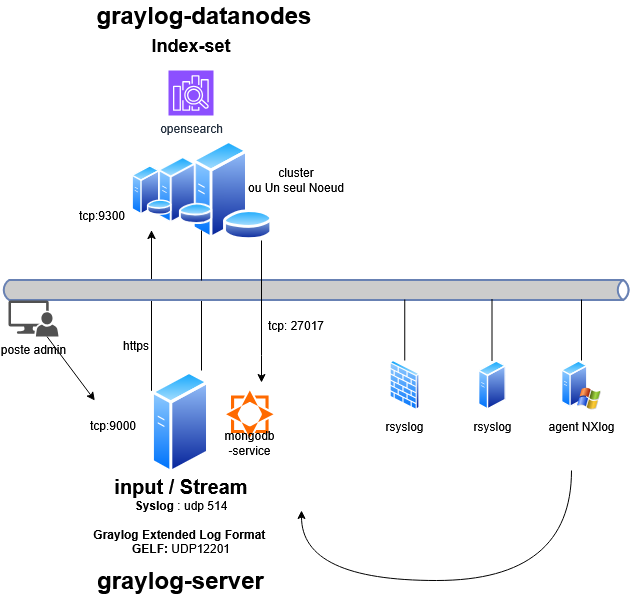

# Serveur de Log

## Objectifs

Apprendre à centraliser, analyser et exploiter les logs avec des outils modernes et ergonomiques, en évitant les solutions obsolètes comme `syslog-ng`.

## Introductiuon

Dans un environnement informatique, **les logs sont la mémoire technique** de votre infrastructure. Ils enregistrent chaque événement, chaque erreur, chaque tentative d’accès – et constituent donc une source d’information **critique** pour la sécurité, le dépannage et la conformité.

Un serveur de logs bien conçu répond aux **quatre piliers de la sécurité de l’information** :

- **Disponibilité** :
  Les logs doivent être **accessibles en temps réel** pour permettre une réaction rapide en cas d’incident (ex : panne, attaque).
  *Exemple* : Un serveur de logs centralisé évite de perdre des informations critiques si un équipement tombe en panne.

- **Intégrité** :
  Les logs doivent être **protégés contre toute altération** (volontaire ou accidentelle).
  *Exemple* : Un attaquant pourrait tenter de supprimer ses traces ; un serveur de logs sécurisé empêche cette manipulation.

- **Confidentialité** :
  Les logs contiennent souvent des **données sensibles** (adresses IP, noms d’utilisateurs, actions système).
  *Exemple* : Un accès non contrôlé aux logs peut exposer des informations personnelles (RGPD).

- **Preuve (Traçabilité)** :
  Les logs servent de **preuve légale** en cas d’audit, d’intrusion ou de litige.
  *Exemple* : En cas de violation de données, les logs permettent de retracer l’origine de l’incident et de prouver la conformité aux réglementations.

## Solution traditionnelles et limites

Historiquement, des outils comme `syslog-ng` ou `rsyslog` ont été utilisés pour centraliser les logs. Cependant, ils présentent plusieurs inconvénients majeurs :

- **Interface utilisateur absente ou obsolète** :
  La gestion des logs se fait souvent en ligne de commande, ce qui rend l’analyse **lente et complexe** pour les équipes opérationnelles.

- **Parsing et recherche limités** :
  Les logs sont stockés sous forme de texte brut, ce qui rend leur exploitation **peu efficace** pour des analyses avancées.

- **Scalabilité insuffisante** :
  Ces outils ne sont pas conçus pour gérer des **volumes massifs de logs** (ex : milliers de messages par seconde).

- **Manque de fonctionnalités modernes** :
  Pas d’alerting natif, pas de dashboards, pas d’intégration facile avec d’autres outils de monitoring ou de sécurité.

 Ces limites justifient le recours à des solutions modernes comme `Graylog`, `ELK` ou `Loki`.

## Présentation de Graylog

Graylog est une plateforme open source conçue pour simplifier la collecte, le stockage, l’analyse et la visualisation des logs, tout en offrant une interface utilisateur moderne et intuitive. Contrairement aux solutions traditionnelles comme syslog-ng, Graylog propose une expérience utilisateur complète, accessible même aux équipes non techniques, sans sacrifier la puissance ni la flexibilité.


**MongoDB:**

MongoDB est utilisé par Graylog pour stocker les informations de configuration, les utilisateurs, les rôles, les dashboards, les alertes, les règles de traitement des logs, etc. Pas les logs eux-mêmes (ce rôle revient à Elasticsearch). 
MongoDB est une base de données NoSQL, idéale pour des données semi-structurées comme les métadonnées.
Rapide pour les lectures/écritures de petites quantités de données (parfait pour la configuration).


**ElasticSearch:**
Elasticsearch est le moteur de recherche et d’analyse qui stocke tous les logs collectés par Graylog. Il permet :

- L’indexation des logs pour une recherche ultra-rapide.
- La recherche full-text (recherche dans le contenu des logs).
- L’analyse (agrégations, visualisations, alertes basées sur des motifs).
- La rétention des logs (selon les politiques de conservation).

Conçu pour gérer des volumes massifs de données (des milliards de logs). Le Moteur est optimisé pour les requêtes complexes et les analyses en temps réel contrairement à un moteur de base de données SQL classique.

### Fonctionnalités clés

- **Interface web ergonomique** :
Graylog offre un tableau de bord personnalisable, des outils de recherche avancée et des visualisations claires. Plus besoin de fouiller dans des fichiers texte ou de maîtriser des commandes complexes : tout est accessible via une interface graphique.
Exemple : Un administrateur peut filtrer les logs par niveau de sévérité, par source ou par période, en quelques clics.


- **Parsing et structuration des logs** :
Grâce à des outils intégré Graylog permet de transformer des logs bruts en données structurées et exploitables.

Exemple : Un log Apache brut 
````bash
(192.168.1.1 - - [10/Oct/2023:13:55:36 +0200] "GET /index.html HTTP/1.1" 200 2326)
````
peut être découpé en champs distincts : 

    - client_ip, 
    - timestamp, 
    - http_method, 
    - status_code, 
    - etc.


- **Alerting et notifications** :
Graylog permet de configurer des alertes en temps réel basées sur des conditions personnalisées (ex : plus de 10 erreurs 500 en 5 minutes). Les notifications peuvent être envoyées par email, Slack, ou via des webhooks.
Cas d’usage : Détecter une attaque par force brute en surveillant les tentatives de connexion échouées.

Bien que Graylog offre des fonctionnalités d’alerting avancées, il ne remplace pas un vrai SIEM (comme Wazuh, Splunk, ou QRadar) pour la détection d’intrusions sophistiquées


- **Scalabilité et performance** :
Graylog s’appuie sur Elasticsearch pour le stockage et la recherche, ce qui lui permet de gérer des volumes massifs de logs (millions de messages par jour). Il supporte également les déploiements en cluster pour une haute disponibilité.


- **Intégrations multiples**:
Graylog est compatible avec de nombreux protocoles (Syslog, GELF, Beats, Kafka) et s’intègre facilement avec des outils de monitoring (Prometheus, Grafana) ou de sécurité (SIEM).

# Stack de Graylog

Graylog repose sur une architecture modulaire, séparant clairement les fonctions de présentation, de traitement et de stockage des logs.

Graylog repose sur à minima 2 serveurs:

  - `graylog-server` : le front et l'appli gérant le dashboard
  - `graylog-datanodes` : le back gérant le stockage avec le moteur opensearch (fork de Elastic)

## Graylog-server

Le Graylog Server constitue le point d’entrée de la plateforme.
Il fournit l’interface d’administration accessible aux utilisateurs habilités et assure le traitement des journaux avant leur stockage.

Il est responsable de :

- Interface web (dashboards, recherches, alertes) 
- Réception des logs (GELF, Syslog, Beats, etc.)
- Parsing, normalisation et enrichissement des logs
- Gestion des utilisateurs, rôles et permissions

Le Graylog Server ne stocke pas les logs de manière persistante.
Sur ce noeud on y installe generallement le service MongoDB.

### Service Mongodb

MongoDB est utilisé comme base de données de configuration.

Il stocke notamment :

  - les utilisateurs et leurs rôles,
  - les tableaux de bord,
  - les streams, alertes et paramètres de la plateforme.

Les logs eux-mêmes ne sont jamais stockés dans MongoDB.

## Graylog-datanode

Le Graylog Data Node est dédié au stockage et à l’indexation des journaux.

Il embarque le moteur `OpenSearch`, qui assure :

  - l’indexation des logs,
  - le stockage des données,
  - les recherches rapides (full-text, filtres, agrégations),
  - la gestion de la rétention (suppression automatique des anciens logs).

 
??? info "OpenSearch"
    OpenSearch est un fork d’Elasticsearch, né suite au changement de licence de ce dernier.

La documentation Graylog recommande l’utilisation d’un espace de stockage dédié, formaté avec le système de fichiers `XFS`, particulièrement adapté aux charges d’écriture intensives générées par les logs.

??? info "système de fichier XFS"
    Très performant avec de gros volumes de données<br/>
    Excellente gestion des fichiers volumineux (logs, bases, VM)<br/>
    Allocation dynamique → moins de fragmentation<br/>
    Scalabilité élevée (pensé pour serveurs et stockage pro)<br/>
    Croissance à chaud du système de fichiers (resize sans arrêt)<br/>
    Très adapté aux usages logs / OpenSearch / Graylog<br/>





```console
admin@graylog:~$ ss -ltn
State         Recv-Q        Send-Q                         Local Address:Port                  Peer Address:Port
LISTEN        0             128                                  w.x.y.z:22                         0.0.0.0:*
LISTEN        0             4096                         192.168.10.100:27017                      0.0.0.0:*
LISTEN        0             4096                [::ffff:192.168.10.100]:9000                             *:*
```

`::ffff:192.168.10.100` signifie qu’un client IPv4 (192.168.10.100) est vu via un socket IPv6 : c’est du dual-stack, l’IPv4 étant encapsulée dans une adresse IPv6.


```console

admin@graylog:~$ ss -lun
State        Recv-Q       Send-Q                                Local Address:Port              Peer Address:Port
UNCONN       0            0                                                 *:514                          *:*
UNCONN       0            0                                                 *:514                          *:*
UNCONN       0            0                                                 *:514                          *:*
UNCONN       0            0                                                 *:514                          *:*
UNCONN       0            0                                                 *:12201                        *:*
UNCONN       0            0                                                 *:12201                        *:*
UNCONN       0            0                                                 *:12201                        *:*
UNCONN       0            0                                                 *:12201                        *:*

```

Graylog ouvre plusieurs listeners (écoute 4 fois sur le même port UDP) pour :

 - gérer plus de débit
 - éviter les blocages
 - paralléliser la réception des logs

```console
admin@datanode-01:~$ ss -ltn
State           Recv-Q          Send-Q                   Local Address:Port                   Peer Address:Port
LISTEN          0               128                            w.x.y.z:22                          0.0.0.0:*
LISTEN          0               4096                                 *:9300                              *:*
LISTEN          0               4096                                 *:8999                              *:*
LISTEN          0               4096                                 *:9200                              *:*
```

- 9200 permet de parler à `OpenSearch` (requêtes, index, stats).
- 9300 sert aux serveurs `OpenSearch` (cluster datanodes) pour se parler entre eux.
- 8999 est le port de contrôle entre Graylog et ses Data Nodes.

# Proposition d'implémentation


L'ensemble des logs seront envoyé via:
- rsyslog (par défaut) ou syslog-ng (à installer) sur les machines linux.
- NXLogs ou Syslog Windows Agent pour les machines windows.

Il faudra en plus installer l'agent du SIEM et autoriser les communication bidirectionnelles vers le réseau gérant le SOC.

Je vous conseille l'installation du SIEM via un container Docker dédié pour faciliter les montées de version (évolution très rapide)
