# 02- Protocole TLS avec OpenSSL

## Mise en place d'un serveur web sécurisé (https) avec le Protocole SSL / TLS avec OpenSSL

### Introduction

Dans ce TP, vous allez configurer notre serveur Apache sur et activer
l'extension *mod_SSL* permettant de sécuriser les communications avec le
protocole Secure Socket Layer dont l'évolution a donné naissance au
protocole TLS (Transport Layer Security).

SSL signifie « Secure Socket Layer » et TLS « Transport Layer
Security ». Les deux sont des protocoles de chiffrement pour permettre
aux requêtes et réponses de circuler de manière **confidentielle** sur
la couche de transport d'Internet. Ils agissent donc au niveau au-dessus
de la couche 4 du modèle OSI. Leur tâche est de **procéder au
chiffrement (aussi appelé cryptage) des flux de données entre un client
et un serveur**.

Dans le modèle théorique OSI on peut les imaginer fonctionnant sur la
**couche 6 : Présentation**. A charge pour les développeurs des
protocoles applicatifs classiques de gérer l'implémentation de la couche
de sécurité associée en respectant le protocole TLS.


Lorsque la communication est effectuée via cette couche de transport
chiffrée, un « s » est ajouté au nom du protocole : *http* devient
*https*, *imap* devient *imaps*, etc. On rencontre également
l'abréviation SSL lorsqu'on parle de certificat SSL. Ce certificat est
nécessaire pour transférer la clé publique du serveur ainsi que son
identité afin d'initier une communication via *TLS.* Ces certificats
sont indispensables à la sécurité sur internet. Ils permettent
l'authentification des machines qui contrairement aux humains ne peuvent
s'authentifier avec des logins/password.

Les certificats sont émis et signés numériquement par des **tiers de
confiance** : L'autorité de certification que l'on peut assimiler à un
notaire lors d'une transaction immobilière. Il est garant de la
vérification de l'identité des vendeurs (mais aussi des acheteurs).

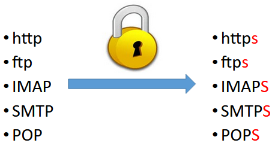

Un protocole sécurisé fonctionne sur un port différent de son homologue non sécurisé.

| Nom    | Port | Nom   | Port                 |
|--------|------|-------|----------------------|
| http   | 80   | https | 443                  |
| ftp    | 21   | ftps  | 990                  |
| imap   | 143  | imaps | 993                  |
| smtp   | 25   | smtps | 465 (obsolète), 587  |
| pop    | 110  | pops  | 995                  |


### Différence entre SSL et TLS

Le **SSL** a été introduit en 1995. Après la découverte d'une série de
lourdes failles de sécurité, la version 2.0 améliorée a ensuite vu le
jour puis la version 3.0 l'année suivante. Plus tard, l'IETF (l'Internet
Engineering Task Force, chargée du développement d'Internet) a rejeté
SSL 3.0 après la découverte de nouvelles failles de sécurité.

**TLS** est le **protocole succédant à SSL**. Il a été introduit en 1999
en tant que version améliorée de SSL 3.0 et fut tout d'abord baptisé SSL
3.1. La version actuelle est TLS 1.3 (depuis 2018).

Dans un premier temps, l'écart entre SSL 3.0 et TLS 1.0 était mince.
« Les différences entre ce protocole (TLS) et SSL 3.0 ne sont pas
fondamentales, mais sont suffisamment importantes pour que TLS 1.0 et
SSL 3.0 ne puissent pas fonctionner ensemble » (traduit librement de la
requête [RFC 2246](https://tools.ietf.org/html/rfc2246)). Par rapport à
SSL 3.0, TLS 1.0 a amélioré la sécurité cryptographique et
l'interopérabilité des applications. La version TLS 1.2 utilisée
actuellement apporte une sécurité accrue contre les attaques des hackers
et permet aux applications une flexibilité nettement plus grande en ce
qui concerne la gestion des algorithmes de chiffrement utilisés (*cipher
suites ou suite cryptographiques*).

Par conséquent, le TLS actuel est **plus sûr, plus flexible et plus
efficace** que l'ancien SSL. Toutefois, comme l'abréviation « SSL » est
aujourd'hui nettement plus connue que « TLS », de nombreux fournisseurs
de logiciels utilisent le terme SSL ou le double terme SSL/TLS alors
qu'ils entendent généralement la version actuelle de TLS, à savoir TLS
1.3.

### Recommandations officielles de la CNIL

Tout site web doit garantir son identité et la confidentialité des
informations transmises.

#### Les précautions élémentaires

-   **Mettre en œuvre le protocole TLS** (en remplacement de SSL) sur
    tous les sites web, en utilisant uniquement les versions les plus
    récentes et en vérifiant sa bonne mise en œuvre.

-   **Rendre l'utilisation de TLS obligatoire** pour toutes les pages
    d'authentification, de formulaire ou sur lesquelles sont affichées
    ou transmises des données à caractère personnel non publiques.

-   **Limiter les ports de communication** strictement nécessaires au
    bon fonctionnement des applications installées. Si l'accès à un
    serveur web passe uniquement par HTTPS, il faut autoriser uniquement
    les flux réseau IP entrants sur cette machine sur le port 443 et
    bloquer tous les autres ports. (Règle de filtrage dans le pare feu)

-   **Limiter l'accès aux outils et interfaces d'administration aux
    seules personnes habilitées.** En particulier, limiter l'utilisation
    des comptes administrateurs aux équipes en charge de l'informatique
    et ce, uniquement pour les actions d'administration qui le
    nécessitent.

-   **Si des *cookies* non nécessaires au service sont utilisés,
    recueillir le consentement** de l'internaute après information de
    celui-ci et avant le dépôt du *cookie*.

-   **Limiter le nombre de composants mis en œuvre,** en effectuer une
    veille et les mettre à jour.

#### Ce qu'il ne faut pas faire

-   Faire transiter des données à caractère personnel dans une URL
    telles que identifiants ou mots de passe.

-   Utiliser des services non sécurisés (authentification en clair, flux
    en clair, etc.).

-   Utiliser les serveurs comme des postes de travail, notamment pour
    naviguer sur des sites web, accéder à la messagerie électronique,
    etc.

-   Placer les bases de données sur un serveur directement accessible
    depuis Internet.

-   Utiliser des comptes utilisateurs génériques (c'est-à-dire partagés
    entre plusieurs utilisateurs).

<https://www.cnil.fr/fr/securite-securiser-les-sites-web>

**Voilà un bon résumé de l'intérêt du cours Cybersécurité du BTS SIO**

## OpenSSL ou Let's Encrypt

**Let\'s Encrypt** (abrégé *LE*) est une autorité de certification
lancée le 3 décembre 2015 (Bêta Version Publique). Cette autorité
fournit des certificats gratuits X.509 pour le protocole cryptographique
TLS au moyen d\'un processus automatisé destiné à se passer du processus
complexe actuel impliquant la création manuelle, la validation, la
signature, l\'installation et le renouvellement des certificats pour la
sécurisation des sites internet. En décembre 2019, Let\'s encrypt
fournit 54,67 % des certificats TLS.

Le projet vise à généraliser l\'usage de connexions sécurisées sur
l'internet. En supprimant la nécessité de paiement, de la configuration
du serveur web, des courriels de validation et de gestion de
l\'expiration des certificats, le projet est fait pour réduire de
manière significative la complexité de la mise en place et de la
maintenance du chiffrement TLS. Sur un serveur GNU/Linux, l'exécution de
seulement deux commandes est censée être suffisante pour paramétrer le
chiffrement HTTPS, l'acquisition et l'installation de certificats, et
ceci en quelques dizaines de secondes. C'est ce que propose OVH même sur
son offre LowCoast.

Let's Encrypt est **LA** solution à moindre coût, toutefois, comme tous
les certificats, son utilisation repose sur l'achat d'un nom de domaine
(que nous n'avons pas). De plus Let's Encrypt automatise le processus
(workflow) entre le client (propriétaire d'un nom de domaine) et le
prestataire (autorité de certification) tier de confiance. Il est
indispensable de bien comprendre les rôles et différentes étapes de ce
processus pour comprendre le fonctionnement de la sécurisation d'un site
web. C'est pourquoi nous utiliserons le logiciel **Openssl** pour
réaliser nos propres certificats et nous faire passer pour une autorité
de certification.

Par ailleurs, la gratuité de Let's encrypt a permis aux cybercriminels
de monter des serveurs sécurisés ce qui empêche la détection des
logiciels malveillants (ils sont chiffrés). Ils ont aussi profité de
l'aubaine pour monter des campagnes de **typo-squatting** (achat de noms
de domaine dont le nom est très proche de la victime ciblée) leur
permettant de monter des copies de sites légitimes avec de véritables
certificats reconnus comme de confiance par les navigateurs. Cela rend
les attaques de **phishing** plus performantes.


Le fameux cadenas vert du navigateur a d'ailleurs disparu pour cette
raison, le cadenas n'est pas le signe que l'on peut faire confiance au
serveur, il indique juste que la communication est chiffrée et qu'un
certificat a bien été émis pour le nom de domaine utilisé. **Cela ne
signifie pas que le propriétaire de ce nom de domaine est un acteur de
confiance**. Il faut donc toujours rester vigilant par rapport aux URL
quel que soit la manière d'y accéder.

## Installation d'OpenSSL 

OpenSSL est un ensemble de bibliothèques et d'outils comprenant tout ce
qui est nécessaire à l'utilisation de la cryptographie forte et des
protocoles SSL (Secure Sockets Layer), TLS (Transport Layer Security)

Il se découpe donc en trois parties :

-   la bibliothèque cryptographique

-   la bibliothèque implémentant SSL/TLS

-   le programme en ligne de commande permettant, entre autres, de
    manipuler les certificats et de mettre en place un serveur
    d'authentification ou une autorité de certification (CA)

Nous allons supposer que nous sommes notre propre autorité de
certification. Cependant en pratique pour le commerce électronique il
est préférable de demander un certificat à une autorité reconnue
(*VeriSign*, etc). De fait, en étant nous-même autorité de certification
nous risquons de ne pas avoir beaucoup de client, puisque nous ne sommes
pas reconnus comme autorité de certification racine dans les
navigateurs. Pour le devenir (installation de notre certificat racine)
il faut que le client nous fasse confiance (en général juste pour une
session).

**A noter** : openssl est aussi utilisable sous windows sans aucun
problème puisque le projet a été développé en C. Il suffit juste de
télécharger une version compilée pour windows 64 bits ou de le compiler
soit même comme un grand.

Pour installer openssl, rien de plus simple avec les gestionnaires de
paquet, mais il est probable qu'il soit déjà installé. ````apt-get install openssl````

PS : à vous de savoir quand il faut préfixer une commande par sudo
désormais.

1.  Taper openssl version pour vérifier

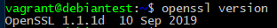

A noter : Nous ne disposons pas de la toute dernière version (1.1.1i de
décembre 2020) mais cela suffira pour notre TP.

!!! danger "Information très importante "
    Vérification du nom de l’objet

    La RFC 2818, publiée en mai 2000, déconseille l’utilisation du champ Common Name (CN) dans les certificats TLS pour la vérification du nom de l’objet. Les certificats TLS sans la section SAN (Subject Alternative Name) ne peuvent plus être utilisés à des fins de vérification.
    Les clients qui utilisent déjà TLS, mais qui n’utilisent pas de SAN, doivent mettre à jour leurs certificats pour se conformer aux nouvelles exigences. Plus important encore, les clients doivent ajouter les DNS et/ou les adresses IP externes au champ SAN (Subject Alternative Names) du certificat. 

    Les navigateurs récents implémentent cette RFC et les certificats sans champ SAN ne sont plus validés.

    OpenSSL ne gere malheuresement pas par défaut ce champ. Voici la solution:

### Configuration openSSL (gestion RFC 2818)

Editer le fichier ```/etc/ssl/openssl.cnf``` . Ce fichier décrit le comportemant que gère openSSL. C'est dans ce fichier que nous imposerons les champs SAN (Subject Alternative Names). 

!!! danger "Information très importante "
    Malheuresement, ces champs ne peuvent être renseignées par l'utilisateur de manière interactive.
    Il faudra donc penser à faire cette manipulation pour chaque site que pour lesquel vous souhaitez générer un certificat.

````bash

[ req ]
distinguished_name = req_distinguished_name
req_extensions = v3_req    #Decommenter cette ligne et trouver la section

...

[ v3_req ]
# Extensions to add to a certificate request
basicConstraints = CA:FALSE
keyUsage = nonRepudiation, digitalSignature, keyEncipherment

#########    Ajouter la ligne suivante:
subjectAltName = @alt_names    # le @alt_names est un pointeur vers la section ci dessous

[ alt_names ]
DNS.1 = example.com             #Saisir le nom du domaine concerné (vous remarquez qu'il n'y a pas l'hôte associé)
DNS.2 = www.example.com         #saisir le nom FQDN de votre site

````

N'oubliez pas d'enregistrer votre fichier

2.  Créer un dossier de travail ( tpssl par exemple) dans la VM avec
    l'arborescence suivante afin de s'organiser un minimum. Vérifiez
    avec la commande tree à installer si vous ne l'avez pas déjà fait :

```bash
├── autorite
│   ├── certificats
│   └── keys
└── siteweb
│   ├── certificats
│   └── keys
└── requests_certificats
```

## Création de la demande de certificat par le propriétaire du site 

Pour l'algorithme RSA (factorisation de deux grands nombre premiers),
L'ANSSI recommande d'utiliser des clés RSA de 2048 bits jusqu'en 2030.
Au-delà il faudra passer à des clés d'une taille de 3072 bits ou changer
d'algorithme en choisissant les courbes elliptiques par exemple. Ne me
demandez pas de détail, c'est de l'expertise mathématique très avancée.

Source : <https://www.keylength.com/fr/5/>

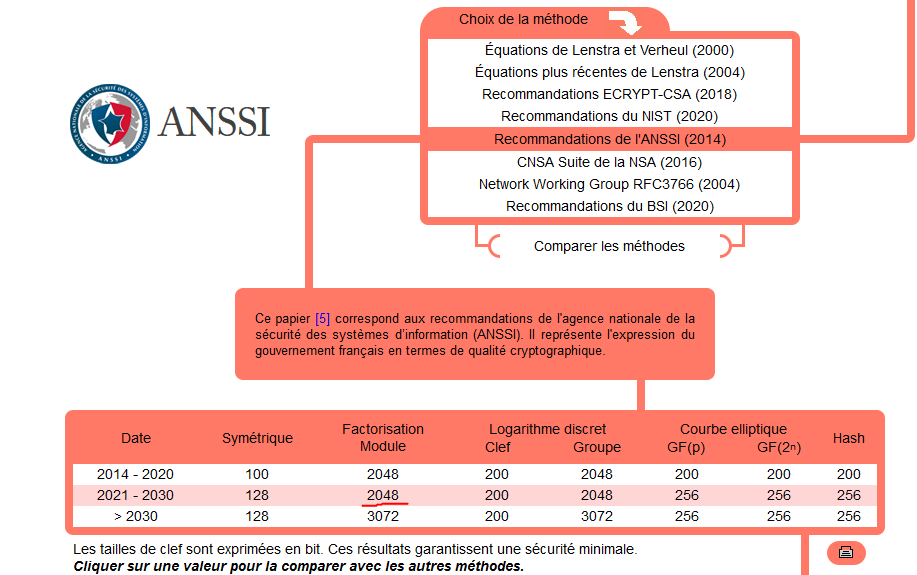

### Génération de la clé privée du serveur web

=== "RSA"

    ```bash
    openssl genrsa 2048 > siteweb/keys/privatekey.key
    ```

=== "courbe eliptique"

    ```bash
    openssl ecparam -genkey -name prime256v1 -out privatekey.key
    ```

4.  Vérifier le contenu du fichier généré avec la commande ````cat```` pour les clés RSA ou pour les **courbes eliptique**

```bash
openssl ec -in privatekey.key -text -noout
```

### Génération d'une demande de certificat pour le serveur web.

La demande de certificat est généré avec openssl via la commande
suivante :

!!! danger "Information très importante "
    Normallement les modifications dans le fichier de conf d'open SSL sont prise en compte mais on peut forcer leur utilisation

=== "classique"

    ```bash
    openssl req -new -key siteweb/keys/privatekey.key > siteweb/requests_certificats/demande.csr 
    ```

=== "Forcer l'usage du fichier de conf "

    ```bash
    openssl req -new -key siteweb/keys/privatekey.key > siteweb/requests_certificats/demande.csr -config /etc/ssl/openssl.cnf
    ```

Le système va vous demander de saisir des champs ; remplissez-les en
adaptant sauf le champ **Common Name** qui doit correspondre
exactement au nom de domaine utilisé correspondant à la directive
**Server Name** défini dans le VHost d'apache. (ex :
[www.lyceefulbert.fr](http://www.lyceefulbert.fr) Attention : ce domaine
existe réellement, en choisir un autre obligatoirement)

Ce n'est pas la peine de saisir d'autres "extra attributes"...

Ce qui permet de générer votre **CSR certificat**. Celle-ci est créée
dans le format PEM encodé en base64, PEM (*Privacy Enhanced Mail*) étant
le format par défaut pour OpenSSL (il s'agit d'un fichier DER encodé en
ASCII et entouré de balises de marquage).

Deux choix s'offrent désormais à nous :

-   envoyer le fichier demande.csr à un organisme (le tiers de confiance
    ou **l\'autorité de certification (CA)**) et ainsi obtenir le
    certificat dûment signé par la clé privée de l'organisme (après
    avoir payé),

-   **ou bien signer nous-même notre certificat avec une autorité que
    nous allons créer pour l'occasion.** Elle ne sera évidement pas
    reconnu comme étant de confiance. Cela ne peut donc pas être mis en
    production dans le monde réel.

C'est ce dernier choix que nous allons voir.

5.   Vérifions tout de même notre demande avant de la traiter :

```bash 
openssl req -in siteweb/requests_certificats/demande.csr -noout -text
```

!!! danger "Important"
    Verifier la présence des champs Subject Alternatives Names


## Création du certificat de l'autorité de certification

Pour signer un certificat, vous devez devenir votre propre autorité de
certification, cela implique donc de posséder une clé privée et un
certificat auto-signé.

6.   La création de la clé privée de l\'autorité de certification se fait
comme précédemment :

```bash
openssl genrsa -des3 2048 > [a vous de préciser le chemin, soyez cohérent SVP] private_ca.key
```

Attention ne pas mélanger le fichier correspondant à notre serveur et
ceux correspondant à l\'autorité de certification.

l\'option -des3 introduit l\'usage d\'une \"passphrase\" qui sera
demandée à chaque utilisation de la clé privée. Ne l'oubliez surtout
pas. Noter le ici : \_\_\_\_\_\_\_\_\_\_\_\_\_\_\_\_\_\_\_\_\_\_\_

7.  Ensuite, à partir de la clé privée, on crée un certificat x509 pour une
durée de validité d\'un an auto-signé :

```bash
openssl req -new -x509 -days 365 -key private_ca.key > autorite/certificats/ca.crt
```

??? Warning "Attention"
    Attention il faut mettre les bons chemins des différents fichiers !!!!
    Utilisez la tabulation pour éviter les erreurs de saisie.

Soyez imaginatif dans la saisie des informations concernant l'autorité.
Elles doivent être différentes des informations saisies précédemment
pour le site web. Ici vous générez votre propre autorité de
certification qui est fictive.

8.  Quel passphrase est attendu ? Pourquoi ?

## Traitement de la demande de certificat de notre serveur par l'autorité de certification fictive

9.  Taper openssl x509 -help pour obtenir l'aide :

La demande de certificat à signer est le fichier
\_\_\_\_\_\_\_\_\_\_\_\_\_\_\_\_\_\_\_\_\_\_\_\_\_\_\_\_\_\_\_\_

10. La commande qui signe la demande de certificat est la suivante :


=== "classique"

    ```bash
    openssl x509 -req -in [te_plante_pas].csr -out [a_adapter].crt -CA [certif_autorite].crt -CAkey [privatekey_ca].key -CAcreateserial -CAserial ca.srl
    ```

=== "Forcer l'usage des champs Subject Alternatives Names (SAN) "

    ```bash
    openssl x509 -req -in [te_plante_pas].csr -out [a_adapter].crt -CA [certif_autorite].crt -CAkey [privatekey_ca].key -CAcreateserial -CAserial ca.srl -extfile /etc/ssl/openssl.cnf -extensions v3_req
    ```

!!! danger "Important"
    Noter bien **-extfile openssl.cnf -extensions v3_req** a la fin de la demande de signature qui impose donc l'usage des options gérant les champs SAN. Il faut evidement le bon chemin. On peut imaginer un fichier de conf d'openssl par siteweb souhaité. A vous de vous adapter.

 

Le certificat signé par l'autorité de certification est le fichier
\_\_\_\_\_\_\_\_\_\_\_\_\_\_\_\_\_\_\_\_\_\_\_\_\_\_\_.

11. Vérifier sa présence dans le système de fichier.

```bash
 ├── autorite
 │   ├── certificats
 │   └── keys
 └── siteweb
 ├── certificats
 ├── keys
 └── requests_certificats
```

12. Vérifier son contenu avec la commande appropriée:

```bash
    openssl x509 -in siteweb/certificats/siteweb.crt -noout -text
```

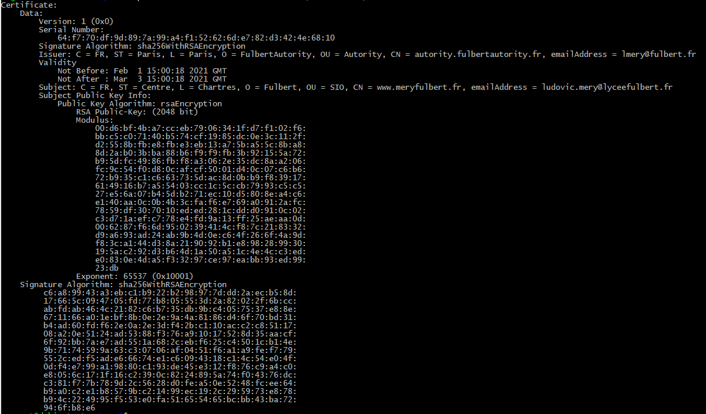

!!! danger "Atttention"
    La copie d'écran ci dessus ne montre pas les champs SAN pourtant nécessaire avec la RFC 2018


## Format PEM

[PEM](https://www.ssl.com/fr/faq/comment-obtenir-mes-certificats-au-format-pem/)
(initialement \"**P**rivalité **E**nhanced **M**ail ») est le format le
plus courant pour
[X.509](https://www.ssl.com/fr/faq/qu%27est-ce-qu%27un-certificat-x-509/)
certificats, CSRs et les clés cryptographiques. Un fichier PEM est un
fichier texte contenant un ou plusieurs éléments en codage ASCII Base64,
chacun avec des en-têtes et pieds de page en texte brut (par exemple
````-----BEGIN CERTIFICATE-----```` et ````-----END CERTIFICATE-----````). 

Un seul fichier PEM peut contenir un certificat
d'entité finale, une clé privée ou plusieurs certificats formant une
chaîne de confiance complète

!!! warning "Remarque"
    Avec Nginx, on utilise souvent des fichiers PEM qui sont des conteneurs avec le certificat et la clé privée. Ca permet de manipuler un seul fichier au lieu de deux.

Le fichier n'est donc pas lisible par l'œil humain sans une conversion
dans un format texte ce qui nous oblige à utiliser l'option -text pour
afficher un contenu lisible.

Pour générer un seul fichier PEM avec le certificat et la clé privée du serveur, il suffit de concatener les 2 fichier dans un troisième en utilisant cat (surtout pas nano) et l'opérateur de redirection de flux > qui crééra un fichier.


````bash
cat file1.crt file2.key > file3.pem
````

## Configuration du serveur WEB

13. Copier le fichier ````/etc/apache2/sites-available/default-ssl.conf```` dans
    son dossier d'origine mais avec le nom de votre site web (celui
    défini dans le champ Common Name). Pensez à bien conserver
    l'extension .conf indispensable pour la commande ````a2ensite````.

14. Modifier le contenu du fichier correspondant à la configuration de
    votre site web en adaptant les directives ````DocumentRoot```` et
    ````ServerName````.

15. Modifier le chemin de ````SSLCertificateFile```` et
    ````SSLCertificatekeyfile```` en fonction de ce que vous avez fait avec
    le logiciel openssl.

16. Activer le module SSL avec la commande ````a2enmod ssl````, activer le
    site, et redémarrer le service comme demandé.

17. Penser à **rediriger le port 443** sur votre VM via votre
    vagrantfile.

18. Tentez d'accéder à votre site web en utilisant son nom (pensez à
    ajuster le **fichier host** si nécessaire).

19. Accepter le certificat et afficher ses informations

## Diagramme de sequence d'une connexion HTTPS

 


## Consultation du site web avec chrome 

 

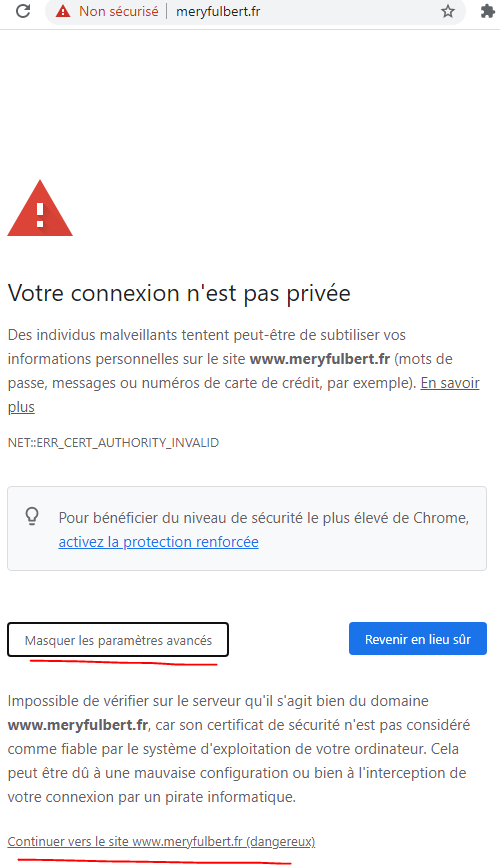

L'avertissement des navigateurs est normal puisque l'autorité de
certification qui a délivré le certificat au propriétaire du site n'est
pas une autorité digne de confiance.

Pour régler le problème il suffit de récupérer le certificat de
l'autorité (ca.crt) et l'insérer dans le magasin des autorités digne de
confiance.

Dans le monde réel ce problème n'existe pas puisqu'on utilise une
autorité de confiance.

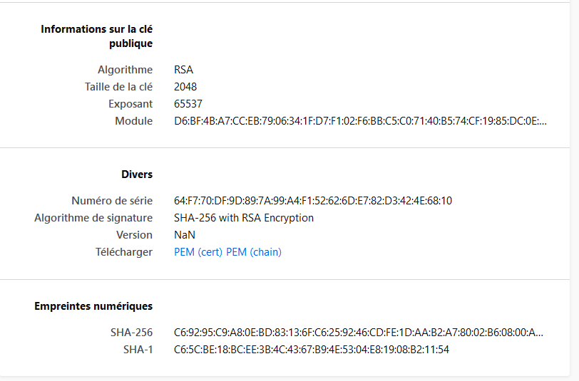

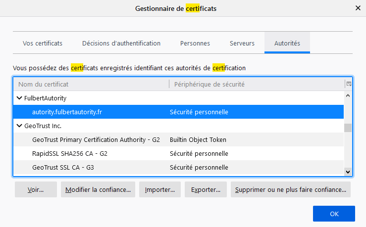

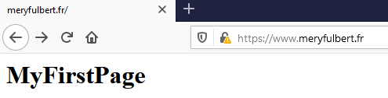

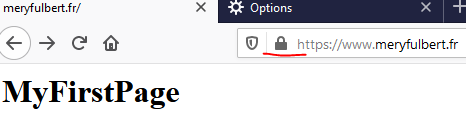

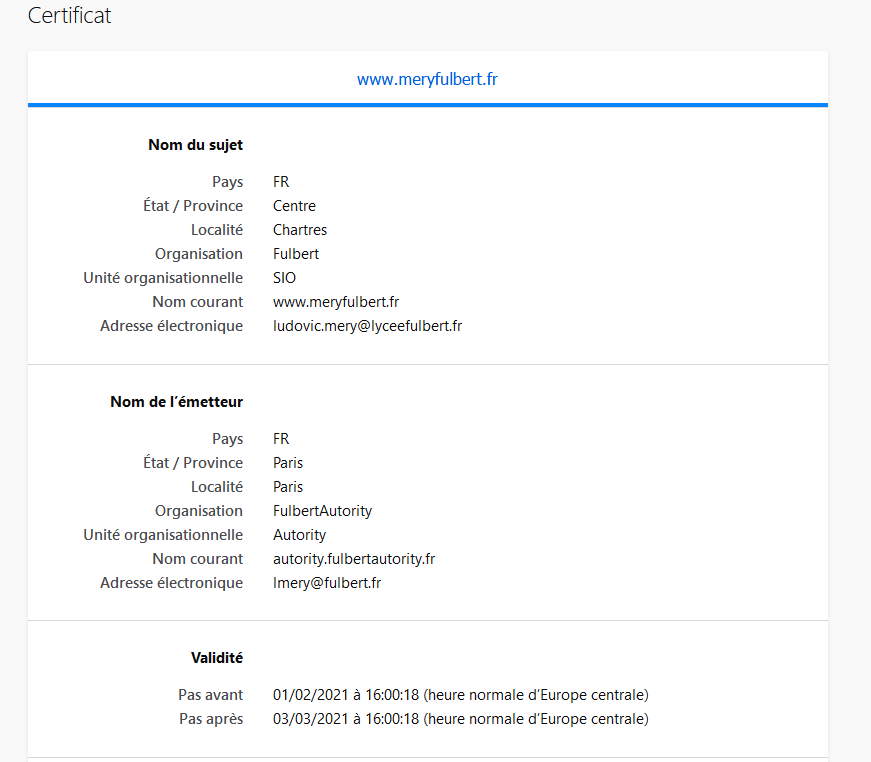

## Exemple de faux certificats forgé


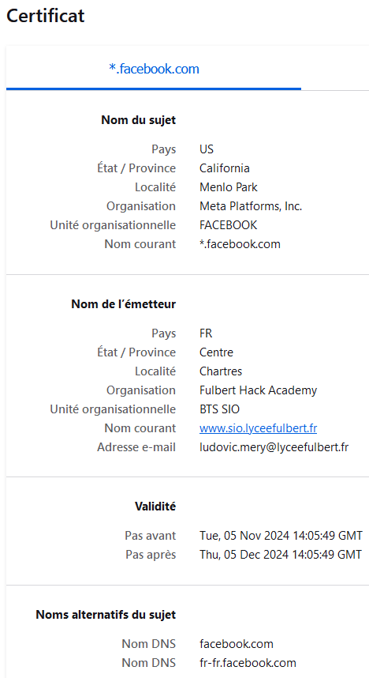

!!! danger "Remarque"
    Prenez bien en compte la présence du champ **Subject Alernative Names** nommé en français **Noms alternatifs du sujet** dans Firefox.
