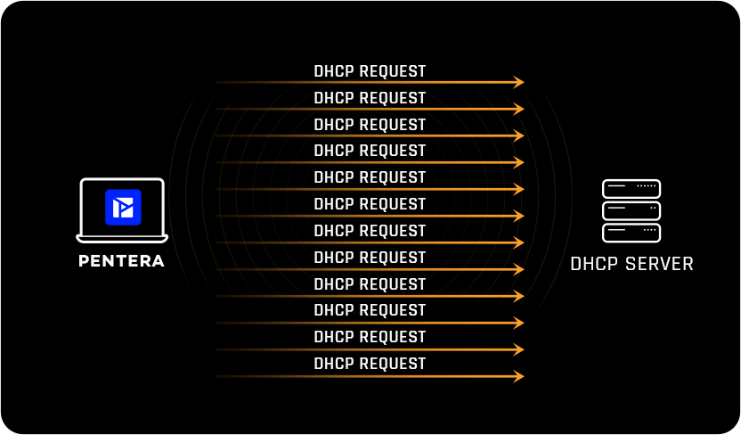

# 2. Couche 2 – Liaison de données

## ARP Spoofing / ARP Poisoning

**Traduction :** Usurpation / empoisonnement ARP

**Principe :**
L’attaquant se fait passer pour la passerelle afin d’intercepter le trafic réseau local.

### Conséquences :

- Man‑In‑The‑Middle local
- Interception d’identifiants (confidentialité)
- Modification du trafic (intégrité)
- Déni de service local (Disponibilité)

### Contre-mesures :

- Switchs manageable (éviter les switchs grand public du commerce)
- DHCP Snooping (permet au switch de bloquer les serveurs DHCP non autorisés afin d’empêcher une attaque de type **DHCP Spoofing** (faux serveur DHCP).)
- VLAN : Segmentation du réseau
- VLAN isolés / Private VLAN
    - Empêche la communication directe entre postes d’un même VLAN
- Port Security:  Limitation du nombre d’adresses MAC par port
- Filtrage ARP statique (réseaux très restreints): vlan de niveau 2

!!! important "A retenir"
      L’ARP spoofing est une attaque locale :
      la meilleure défense est la segmentation et l’isolation réseau, pas uniquement le chiffrement.

## MAC Flooding

**Traduction :** Saturation de table MAC (Innondation)

**Principe :**
Inondation du switch avec de fausses adresses MAC pour le forcer à diffuser les trames.

**Contre-mesures :**

- Port Security
- Limitation du nombre de MAC par port

## Attaques DHCP

### DHCP Starvation

**Traduction :** Saturation du serveur DHCP  

### Principe
L’attaquant envoie un grand nombre de requêtes DHCP avec des **adresses MAC falsifiées** afin d’épuiser le pool d’adresses IP du serveur DHCP.



### Conséquences:

- Plus aucune adresse IP disponible
- Déni de service réseau (DoS)
- Nouveaux postes incapables de se connecter

### DHCP Spoofing et DHCP Rogue

**Traduction :** Usurpation de serveur DHCP  

**Principe**
Après une attaque de starvation, l’attaquant met en place un **faux serveur DHCP** qui fournit :

- une fausse passerelle
- un faux DNS

Permet ensuite des attaques MITM ou DNS spoofing.

## Contre‑mesures

### Mesures réseau (essentielles)

- **Switchs managés**
  - **DHCP Snooping** (voir si dessous)
    - Ports *trusted* (serveur DHCP)
    - Ports *untrusted* (clients)
- **Rate limiting DHCP**
- **Port Security**
  - Limitation du nombre de MAC par port
- **VLAN / VLAN isolés**
  - Limiter la propagation de l’attaque

### Mesures serveur

- Pool DHCP dimensionné correctement
- Durée de bail adaptée
- Supervision du serveur DHCP

### Mesures complémentaires

- IP statiques pour équipements critiques
- IDS/IPS réseau
- Segmentation Wi‑Fi (invités / internes)

## Risque de confusion

| Attaque | Principe | Portée | Dangerosité |
|-------|----------|--------|-------------|
| DHCP Spoofing | Falsification de réponses DHCP | Ciblée | Moyenne |
| DHCP Rogue | Faux serveur DHCP complet | Réseau entier | Élevée |


Le DHCP est un service critique mais non sécurisé par défaut.  
Sans contrôle au niveau des switchs, il est vulnérable aux attaques locales.
L'isolation est donc indispensable pour limiter la surface d'attaque.


## Contre mesure avec DHCP Snooping

**Traduction :** Surveillance / filtrage DHCP

### Principe :  
Le DHCP Snooping permet au switch de bloquer les serveurs DHCP non autorisés  
afin d’empêcher une attaque de type **DHCP Spoofing** (faux serveur DHCP).

Le switch distingue :
- Ports **trusted** (serveur DHCP légitime)
- Ports **untrusted** (postes clients)

Seuls les ports "trusted" peuvent envoyer des réponses DHCP.

### Fonctionnement :

  1. Le switch intercepte les messages DHCP.
  2. Il autorise uniquement les réponses venant d’un port marqué "trusted".
  3. Il construit une base de données IP ↔ MAC ↔ Port (binding table).

Exemple de configuration

```bash
ip dhcp snooping
ip dhcp snooping vlan 10,20,30  # id Vlans ou se trouvent les clients légitimes

interface g0/1    # le port sur lequel se trouve le serveur DHCP ou le relai DHCP (souvent un port d'interco 802.1Q)
ip dhcp snooping trust   # autorise a voir des réponses DHCP

interface g0/10   # on limite le nombre de requetes clients DHCP venant sur ce port
ip dhcp snooping limit rate 10 #Evite les attaques DHCP Starvation

```

!!! important "A retenir"
    Avec DHCP Snooping, seuls les ports “trusted” peuvent envoyer des réponses DHCP.
    En cas de relay, le port vers le routeur ou serveur doit être trusted.

## Autres attaques possibles

### MAC Spoofing

Usurper l’adresse MAC d’un autre appareil pour usurper son identité, contourner des règles de contrôle d’accès basé sur l'adresse physique.