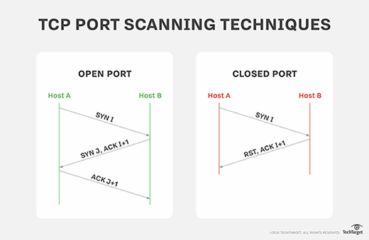

# 4. Couche 4 – Transport

## SYN Flood
**Traduction :** Attaque par saturation SYN

### Principe :

L’attaquant envoie de nombreuses requêtes TCP SYN sans terminer la connexion (n'envoi pas le ACK en réponse au SYN du serveur).

### Conséquences :

- Déni de service (DoS)

### Contre-mesures :

- SYN cookies
- Firewall
- Load balancer

## UDP Flood

**Traduction :** Attaque par saturation UDP

### Principe :
Envoi massif de paquets UDP vers la cible.

### Contre-mesures :

- Filtrage
- Rate limiting

## Port scanning

L’attaquant scanne les ports (TCP/UDP) pour repérer les services ouverts, ce qui aide ensuite à choisir les attaques ciblées. Ce n’est pas une attaque qui cause directement un crash, mais c’est souvent le premier mouvement d’un pirate.
Avec un outil comme `Nmap`, l’attaquant peut :

- détecter les ports ouverts ;
- identifier le type de service (web, FTP, SSH…) ;
- parfois déterminer la version du service ;
- identifier le système d’exploitation ;
- tester certaines vulnérabilités via des scripts (NSE).

## TCP RST Injection

Dans TCP, le flag RST (Reset) sert à terminer immédiatement une connexion.

Normalement, il est utilisé quand :

- une erreur survient,
- un port n’est pas ouvert,
- une connexion devient invalide.

Un attaquant peut envoyer un paquet TCP avec le flag RST activé en usurpant l’adresse IP d’un des deux participants à la connexion.

Résultat :

- la victime croit que l’autre machine veut arrêter la communication ;
- la connexion est immédiatement coupée.

Contre mesure:

- Filtrer les paquets suspects via firewall
- IDS/IPS pour détecter les paquets RST anormaux

!!! important "A retenir"
    c’est une attaque sur la **disponibilité**, necessitant une attaque d'IP Spoofing en amont
