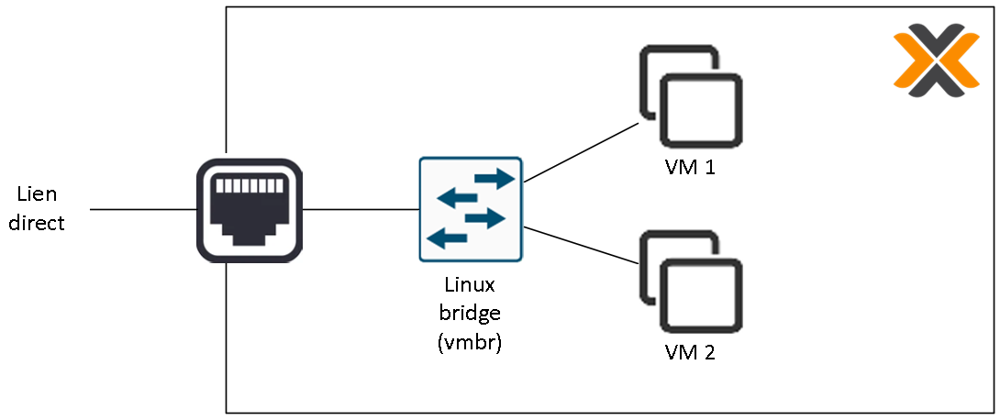
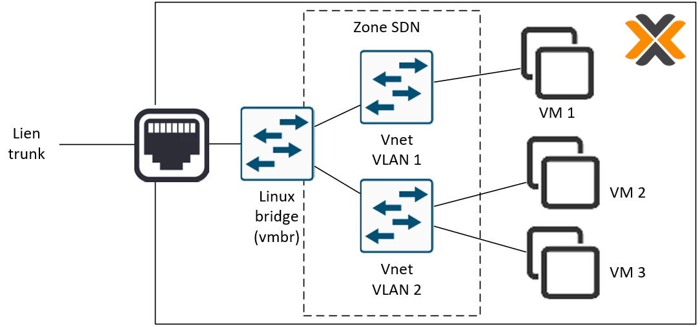
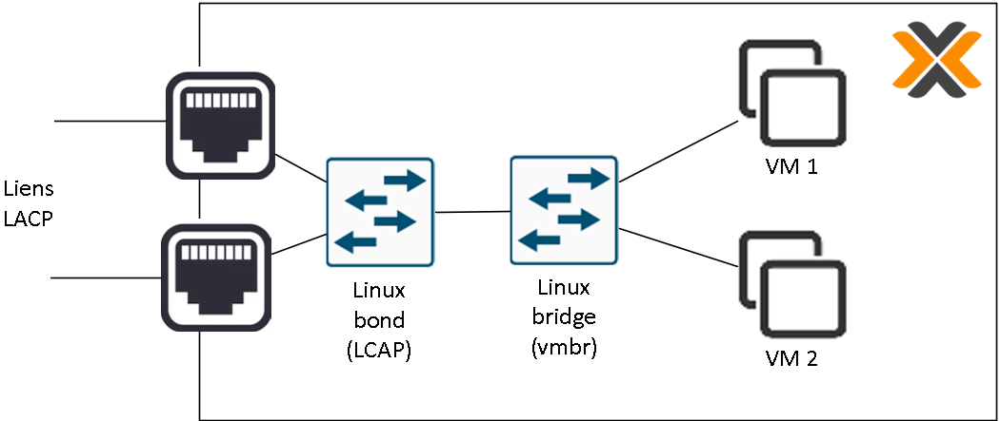

# 07-Gestion des réseaux sous Promox

## Réseaux et virtualisation

Dans un hyperviseur, tous les éléments réseau se trouvant "derrière" la carte réseau sont virtuels. Selon les hyperviseurs, il est possible de virtualiser ou non certains concept réseaux. Proxmox étant basé sur GNU/Linux, il est possible de virtualiser un vaste panel de ces concepts de manière flexible.
Il existe 3 principaux types d'éléments réseau très utiles dans Proxmox :
- **Linux Brige** : un switch virtuel pouvant acheminer des VLAN (en mode trunk)
- **Linux VLAN** : un switch virtuel dédié à un VLAN mettant à disposition des interfaces en mode access
- **Linux Bond** : une aggrégation d'interfaces physiques gérant plusieurs protocoles (notamment LACP)

Pour gérer les différents éléments réseaux de Proxmox, il suffit de cliquer sur le noeud en question dans l'interface web, puis d'aller dans l'item "Système" => "Réseau".

## Combinaisons d'éléments

Dans proxmox, il est possible de combiner ces différents éléments en les cascadant pour parvenir la solution recherchée. Ainsi, connecter un "Linux VLAN" sur un "Linux Bridge" permettra de connecter des machines virtuelles directement dans le VLAN voulu en access, en affectant l'une de ses carte réseau au "Linux VLAN" créé.

Exemple de connexion directe de VMs au réseau de l'hyperviseur :

Exemple de connexion de VMs un VLAN avec interconnexion de l'hyperviseur en mode trunk :

Exemple de connexion directe de VMs avec interconnexion de l'hyperviseur en LACP 

