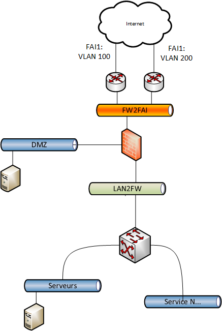
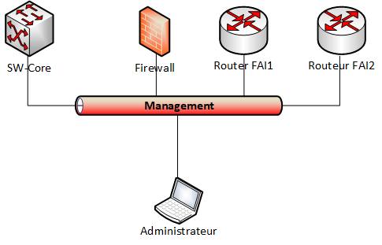
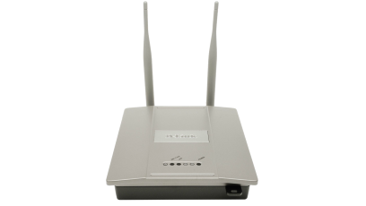

# Annexes

## Annexe 1 - Schéma logique minimal l’infrastructure de chaque site géographique

## Annexe 2 - Schéma logique du réseau de management

??? Warning "Nouveauté 2026"

    Un vlan de management dédié est utilisable sur la ferme de serveurs Nutanix:  
    110 -->Bourges,  
    120 --> Chartres,   
    etc...

## Annexe 3 - Schéma physique l’infrastructure

Les ports sont evidement à choisir par les étudiants

## Annexe 4 - Plan d'adressage IP

|                                | **Site de**      |                 |                 |                 |
|--------------------------------|------------------|-----------------|-----------------|-----------------|
| **LAN global**                 |                  |                 |                 |                 |
| Nombre d'hôtes                 |                  |                 |                 |                 |
| Nombre de serveurs             |                  |                 |                 |                 |
| Adresse réseau                 |                  |                 |                 |                 |
| Masque                         |                  |                 |                 |                 |
|                                |                  |                 |                 |                 |
| **Plan adressage sous réseau (VLAN)**|            |                 |                 |                 |
| **VLAN service + ID ferme de serveur** | ** **    | ** **          | ** **          | ** **          |
| Nombre d'hôtes                 |                  |                 |                 |                 |
| Masque CIDR                    |                  |                 |                 |                 |
| Masque décimal                 |                  |                 |                 |                 |
| Adresse du réseau              |                  |                 |                 |                 |
| Adresse de diffusion           |                  |                 |                 |                 |
| Plage fixe                     |                  |                 |                 |                 |
| Plage DHCP principal           |                  |                 |                 |                 |
| Plage DHCP secondaire          |                  |                 |                 |                 |
| Passerelle                     |                  |                 |                 |                 |
| relai DHCP (oui / non)         |                  |                 |                 |                 |

|                           |  **Site de**   |                |                |                |
|---------------------------|----------------|----------------|----------------|----------------|
| **Routeur Pare Feu**      |                |                |                |                |
| **Vlan Transport VLAN ID**| **Interface eth0** | **Interface eth1** | **Interface eth2** | **Interface eth3** |
| vers service              |                |                |                |                |
| Adresse                   |                |                |                |                |
| Masque                    |                |                |                |                |
|                           |                |                |                |                |
| **Routeurs FAI**          |                |                |                |                |
|                           | **Interface eth0 (publique)** | **Interface eth1 (privée)** | **Interface virtuelle** |
|                           |                |                |                |                |
| **R1**                    |                |                |                |                |
| VLAN                      | 100            |                |                |                |
| Adresse                   |                |                |                |                |
| Masque                    |                |                |                |                |
| **Passerelle**            |                |                |                |                |
| **R2**                    |                |                |                |                |
| VLAN                      | 200            |                |                |                |
| Adresse                   |                |                |                |                |
| Masque                    |                |                |                |                |
| **Passerelle**            |                |                |                |                |

## Annexe 5 - Plan d'adressage IP des serveurs (suite)

|                                    | **Site de**   |               |               |               |               |               |               |               |       |
|------------------------------------|---------------|---------------|---------------|---------------|---------------|---------------|---------------|---------------|-------|
|                                    |               |               |               |               |               |               |               |               |       |
| **Nom**                            | **VM sur la ferme** | **VLAN (étiquette réseau)** | **Adresse IP et masque CIDR** | **Masque (notation décimale** | **Passerelle** | **login** | **password** | **OS** |       |
|                                    |               |               |               |               |               |               |               |               |       |
|                                    |               |               |               |               |               |               |               |               |       |
|                                    |               |               |               |               |               |               |               |               |       |
|                                    |               |               |               |               |               |               |               |               |       |
|                                    |               |               |               |               |               |               |               |               |       |
|                                    |               |               |               |               |               |               |               |               |       |
|                                    |               |               |               |               |               |               |               |               |       |
|                                    |               |               |               |               |               |               |               |               |       |
|                                    |               |               |               |               |               |               |               |               |       |
|                                    |               |               |               |               |               |               |               |               |       |
|                                    |               |               |               |               |               |               |               |               |       |
|                                    |               |               |               |               |               |               |               |               |       |
|                                    |               |               |               |               |               |               |               |               |       |
|                                    |               |               |               |               |               |               |               |               |       |

### Serveurs publiques (Internet simulé) et serveurs hébergés dans DMZ

| **Nom**            | **VM sur la ferme** | **VLAN (étiquette réseau)** | **Adresse IP et masque CIDR** | **Masque (notation décimale** | **Passerelle** | **login** | **password** | **OS** |
|--------------------|--------------------|-------------------------|-----------------------------|-----------------------------|----------------|----------|--------------|-------|
| Registar DNS       |                    | 200                     | 121.283.90.205 / 29          | 255.255.255.248             | 121.283.90.206 |          |              |       |
|                    |                    |                         |                             |                             |                |          |              |       |
|                    |                    |                         |                             |                             |                |          |              |       |
|                    |                    |                         |                             |                             |                |          |              |       |

## Annexe 6 - Plan de brassage. 

| **SW1 2960-24** | **Ports** | **VLAN** | **SW1 2960-24** | **Ports** | **VLAN** |
|-----------------|-----------|---------|----------------|----------|---------|
|                 | Fa0/1     |         |                | Fa0/1    |         |
|                 | Fa0/2     |         |                | Fa0/2    |         |
|                 | Fa0/3     |         |                | Fa0/3    |         |
|                 | Fa0/4     |         |                | Fa0/4    |         |
|                 | Fa0/5     |         |                | Fa0/5    |         |
|                 | Fa0/6     |         |                | Fa0/6    |         |
|                 | Fa0/7     |         |                | Fa0/7    |         |
|                 | Fa0/8     |         |                | Fa0/8    |         |
|                 | Fa0/9     |         |                | Fa0/9    |         |
|                 | Fa0/10    |         |                | Fa0/10   |         |
|                 | Fa0/11    |         |                | Fa0/11   |         |
|                 | Fa0/12    |         |                | Fa0/12   |         |
|                 | Fa0/13    |         |                | Fa0/13   |         |
|                 | Fa0/14    |         |                | Fa0/14   |         |
|                 | Fa0/15    |         |                | Fa0/15   |         |
|                 | Fa0/16    |         |                | Fa0/16   |         |
|                 | Fa0/17    |         |                | Fa0/17   |         |
|                 | Fa0/18    |         |                | Fa0/18   |         |
|                 | Fa0/19    |         |                | Fa0/19   |         |
|                 | Fa0/20    |         |                | Fa0/20   |         |
|                 | Fa0/21    |         |                | Fa0/21   |         |
|                 | Fa0/22    |         |                | Fa0/22   |         |
|                 | Fa0/23    |         |                | Fa0/23   |         |
|                 | Gi0/1     |         |                | Gi0/1    |         |
|                 | Gi0/2     |         |                | Gi0/2    |         |

## Annexe 7 - Identifiants & mots de passe 

**Tables des noms DNS**

| **nom**         |   **ip**       |
|----------|----------|
|          |          |
|          |          |
|          |          |
|          |          |
|          |          |
|          |          |
|          |          |
|          |          |
|          |          |
|          |          |

## Annexe 8 - Infrastructure Publique simulée dans le labo du lycée Fulbert

##  Annexe 9

### Adressage IP publique des sites

| **VLAN ID** | **Routeur FAI** | **interface publique** | **Chartres**        | **Orléans**         | **Tours**           | **Bourges**     |
|------------|----------------|----------------------|--------------------|--------------------|--------------------|--------------------|
| 100        | R1             | adresse IP           | 221.87.128.2 /30   | 221.87.145.2 /30   | 221.87.137.2 /30   | 221.87.118.2 /30   |
|            |                | masque               | 255.255.255.252    | 255.255.255.252    | 255.255.255.252    | 255.255.255.252    |
|            |                | passerelle           | 221.87.128.1       | 221.87.145.1       | 221.87.137.1       | 221.87.118.1       |
| 200        | R2             | adresse IP           | 183.44.28.1 /30    | 183.44.45.1 /30    | 183.44.37.1 /30    | 183.44.18.1 /30    |
|            |                | masque               | 255.255.255.252    | 255.255.255.252    | 255.255.255.252    | 255.255.255.252    |
|            |                | passerelle           | 183.44.28.2        | 183.44.45.2        | 183.44.37.2        | 183.44.18.2        |

### Routeurs simulant internet dans l’infrastructure du lycée Fulbert

| **VLAN ID** | **Routeur internet** | **interface**      | **IP**                | **Masque**       | **Réseau**         | **Broadcast**    |
|------------|----------------------|--------------------|-----------------------|-----------------|-------------------|-----------------|
| 100        | R1                   | chartres           | 221.87.**128**.1 /30  | 255.255.255.252 | 221.87.128.0      | 221.87.128.3    |
|            |                      | orléans            | 221.87.**145**.1 /30  | 255.255.255.252 | 221.87.145.0      | 221.87.145.3    |
|            |                      | tours              | 221.87.**137**.1 /30  | 255.255.255.252 | 221.87.137.0      | 221.87.137.3    |
|            |                      | Bourges        | 221.87.**136**.1 /30  | 255.255.255.252 | 221.87.118.0      | 221.87.118.3    |
|            |                      | reste du monde     | 121.183.90.**201** /29| 255.255.255.248 | 121.183.90.200    | 121.183.90.207  |
|            |                      | PASSERELLE         | 121.183.90.**206**    |                 |                   |                 |
| 200        | R2                   | chartres           | 183.44.**28**.1 /30   | 255.255.255.252 | 183.44.28.0       | 183.44.28.3     |
|            |                      | orléans            | 183.44.**45**.1 /30   | 255.255.255.252 | 183.44.45.0       | 183.44.45.3     |
|            |                      | tours              | 183.44.**37**.1 /30   | 255.255.255.252 | 183.44.37.0       | 183.44.37.3     |
|            |                      | Bourges        | 183.44.**36**.1 /30   | 255.255.255.252 | 183.44.18.0       | 183.44.18.3     |
|            |                      | reste du monde     | 121.183.90.**202** /29| 255.255.255.248 | 121.183.90.200    | 121.183.90.207  |
|            |                      | PASSERELLE         | 121.183.90.**206**    |                 |                   |                 |
|            |                      | RSportFulbert      | Vers Internet simulé | 121.183.90.**206**/29| 255.255.255.248 | 121.183.90.200  | 121.183.90.207  |
|            |                      |                    | Vers Fulbert          | 10.200.255.**1**/16| 255.255.0.0      | 10.200.0.0      | 10.200.255.255  |
|            |                      |                    | PASSERELLE            | 10.200.255.**254** | Commentaire NAT réseau 128.183.90.200 --> 10.200.255.1 |

## Annexe 10

**Les équipements de réseau**

### DLINK 3200 AP

| **DLINK 3200 AP**                     |                                                                                                                      |
|---------------------------------------|----------------------------------------------------------------------------------------------------------------------|
| **Désignation**                       | **Point d’Accès WIFI**                                                                                            |
| **Caractéristiques matériels**         | - Boîtier solide en métal certifié Plenum   - Technologie Power over Ethernet (PoE) 802.3af intégrée - Deux antennes à gain élevé amovibles - Base PoE (Power over Ethernet) fournie - Supports de verrouillage inclus |
| **Mode de fonctionnement**             | - AP - WDS - AP + WDS                                                                                       |
| **Connectivité haute performance**     | - Débits sans fil conformes à la norme 802.11g - Débits de transfert de données sans fil pouvant atteindre 54 Mbps* - Débit sans fil de 108 Mbps avec la technologie 108G D-Link*                                           |
|                                       | *Le débit maximal du signal sans fil est basé sur les spécifications de la norme IEEE 802.11g. Dans la réalité, sa valeur pourra varier. En effet, les conditions réseau et les facteurs environnementaux peuvent restreindre le débit réel des données. |
| **Sécurité**                           | - Chiffrement des données WEP 64/128/152 bits - WPA Personal/WPA Enterprise - WPA2 Personal/WPA2 Enterprise - Authentification utilisateur 802.1x - AES - SSID multiples 802.1Q/segmentation réseau - Filtrage des adresses MAC |
| **Administration**                     | - Logiciel AP Manager - Navigateur Web (HTTP) - Telnet - SNMP v.3                                         |

### Routeurs Cisco

| **Routeur Cisco**                     |                                                                                                                      |
|---------------------------------------|----------------------------------------------------------------------------------------------------------------------|
| **Model**                             | **Brand** CISCO **Series** 1900 **Model** CISCO1921/K9                                                              |
| **SPEC**                              | **Speed** 10/100/1000Mbps LAN **Ports** 2 x 10/100/1000Mbps                                                          |
|                                       | **VPN** IPSec, PPTP, L2TP                                                                                          |
| **Features**                          | **Interfaces/Ports:**  2 x RJ-45 10/100/1000Base-T Network LAN  1 x RJ-45 Auxiliary Management  1 x RJ-45 Console Management  1 x Type A USB 2.0 USB  1 x Type B USB Management |
|                                       | **I/O Expansions:**  Number of Expansion Slots: 2  Expansion Slots: (2 Total) HWIC                          |
|                                       | **Management:**  SNMP RMON Syslog NetFlow TR-069 IEEE 802.1p QoS  IEEE 802.1q VLAN Web Based Management Cisco Configuration Professional  CiscoWorks LMS CiscoWorks NCM Cisco Security Manager  Cisco Unified Provisioning Manager Cisco License Manager Cisco Configuration Engine |
|                                       | **Memory:**  Standard Memory: 512 MB  Maximum Memory: 512 MB  Memory Technology: DRAM  Flash Memory: 256 MB  The Cisco 1921 builds on the best-in-class offering of the Cisco 1841 Integrated Services Routers.  All Cisco 1900 Series Integrated Services Routers offer embedded hardware encryption acceleration, optional firewall, intrusion prevention, and advanced security services.  In addition, the platforms support the industry's widest range of wired and wireless connectivity options such as Serial, T1/E1, xDSL, Gigabit Ethernet, and third-generation (3G) wireless. |

### Switch CISCO 2960

| **Switch CISCO 2960 - 48 ports**    |                                                                                                                    |
|-------------------------------------|--------------------------------------------------------------------------------------------------------------------|
|                                     |                                                                                                                    |
|                                     |                                                                                                                    |
| **Description du produit**          | **Cisco Catalyst 2960-24TC-S - commutateur - 24 ports - Géré - Montable sur rack**                                |
| **Type de périphérique**            | Commutateur - 24 ports - Géré                                                                                    |
| **Type de châssis**                 | Montable sur rack 1U                                                                                            |
| **Interfaces**                      | Fast Ethernet                                                                                                    |
| **Ports**                           | 24 x 10/100 + 2 x SFP Gigabit combiné                                                                           |
| **Performances**                    | Capacité de commutation : 16 Gbps Performances de transfert (taille de paquet 64 octets) : 6,5 Gbps            |
| **Taille de la table d'adresses MAC** | 8 000 entrées                                                                                                   |
| **Protocole de gestion à distance**  | SNMP 1, SNMP 2, RMON 1, RMON 2, Telnet, SNMP 3, SNMP 2c, HTTP, HTTPS, TFTP, SSH-2                               |
| **Caractéristiques**                | Layer 2 switching, auto-détection par dispositif, compatible DHCP, auto-négociation, prise en charge du réseau local (LAN) virtuel, auto-uplink (MDI/MDI-X auto), IGMP snooping, prise en charge de Syslog, prise en charge DiffServ, contrôle de la tempête de Broadcast, Multicast Storm Control, Unicast Storm Control, prise en charge du protocole RSTP (Rapid Spanning Tree Protocol), prise en charge du protocole Multiple Spanning Tree Protocol (MSTP), assistance Dynamic Trunking Protocol (DTP), assistance Port Aggregation Protocol (PAgP), qualité de service (QDS), Link Aggregation Control Protocol (LACP), Port Security, notification de l'adresse MAC |
| **Conformité aux normes**           | IEEE 802.3, IEEE 802.3u, IEEE 802.3z, IEEE 802.1D, IEEE 802.1Q, IEEE 802.3ab, IEEE 802.1p, IEEE 802.3x, IEEE 802.3ad (LACP), IEEE 802.1w, IEEE 802.1x, IEEE 802.1s, IEEE 802.3ah, IEEE 802.1ab (LLDP) |
| **Alimentation**                    | CA 120/230 V ( 50/60 Hz )                                                                                       |
| **Dimensions (LxPxH)**              | 44.5 cm x 23.6 cm x 4.4 cm                                                                                      |
| **Poids**                           | 3.65 kg                                                                                                           |
| **Garantie du fabricant**           | Garantie limitée à vie                                                                                           |

